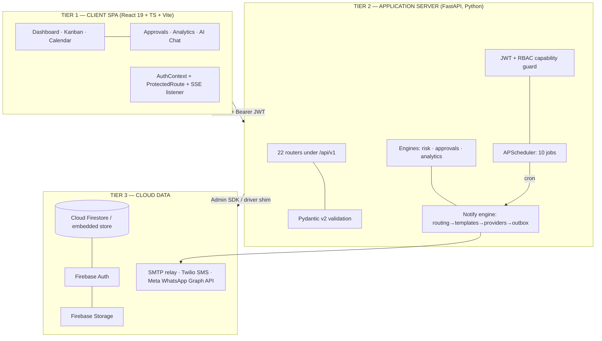
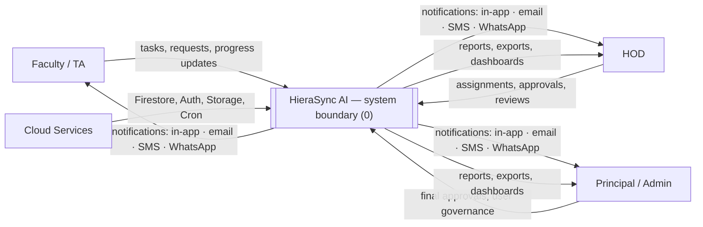
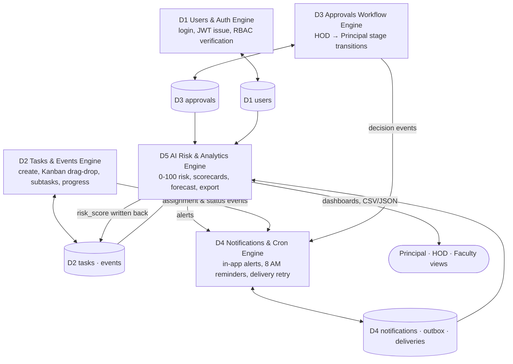
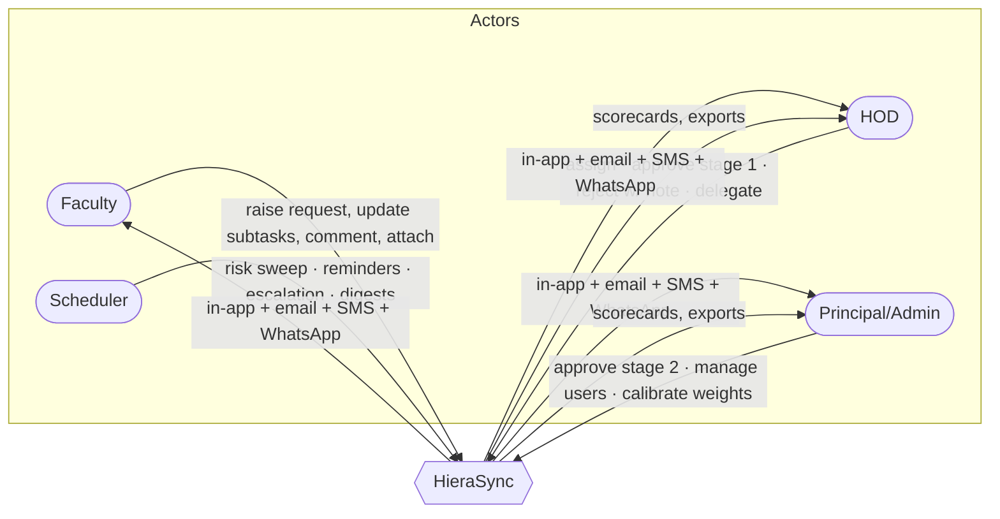
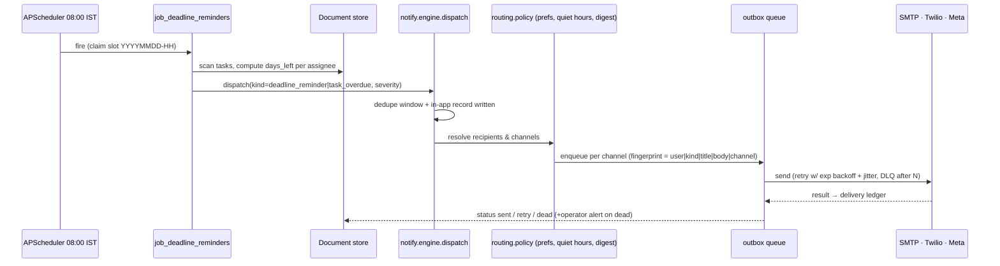

# HieraSync AI — System Design, Architecture, Flows & Modules

*Covers Slides 9–15, 17–19: design approach & methodology, 3-tier architecture, DFD L0/L1, use case & RBAC, database design, core workflow, module status and the two deep dives.*

---

## 1. Design approach & methodology (Slide 9)

**Agile module slices.** Each feature is an independent vertical slice: *API router + UI page + collection schema*. Evidence in the tree — `app/api/v1/<name>.py` ↔ `frontend/src/pages/<Name>.tsx` ↔ collection `<name>`. Adding a module never edits another module (v2 added 4 modules — risk, workflow, metrics, channels — with zero changes to the 17 existing routers beyond two compatibility shims).

**3-tier decoupling.** Client SPA → FastAPI REST logic → cloud data. No business logic in components, no SQL/NoSQL calls in templates; the data layer is behind one `get_db()` dependency so Tier 3 is swappable.

**Security-first middleware.** JWT issue/verify + role dependency on every endpoint; capabilities resolved through the Slide 13 matrix rather than ad-hoc role lists.

**Automation layer.** APScheduler cron jobs (10 registered) for the daily 8 AM reminders and the follow-up ladder; a durable outbox worker delivers asynchronously so HTTP paths never block on SMTP/Twilio.

**Key architectural decisions (deck) → implementation:** Firestore NoSQL for flexible workflow documents; router-per-module API; zero-cost heuristic AI; audit-friendly approvals. Each is justified with trade-offs in `docs/05`.

## 2. System architecture (Slide 10)



<details><summary>ASCII fallback (for print / Word submission)</summary>

```
+---------------------------------------------------------------+
| TIER 1  React 19 + TypeScript + Vite SPA                      |
|   Dashboard | Kanban | Calendar | Approvals | Analytics | AI  |
|   AuthContext · ProtectedRoute · NotificationCenter (SSE)     |
+------------------------------+--------------------------------+
                               | HTTPS, Bearer JWT
+------------------------------v--------------------------------+
| TIER 2  FastAPI (Python) — /api/v1                            |
|   22 routers · Pydantic v2 · JWT + role/capability middleware |
|   engines: risk(8-factor) · approvals(state machine) ·        |
|            analytics(KPIs)                                    |
|   automation: APScheduler 10 jobs -> notify engine -> outbox  |
+------------------------------+--------------------------------+
        | Admin SDK / shim               | SMTP · Twilio · Meta Graph
+-------v-----------------------+  +------v----------------------------+
| TIER 3  Firestore NoSQL       |  | External delivery gateways        |
|  Auth · Storage  (or embedded  |  |  (or dev outbox files, offline)   |
|  document store for dev/CI)   |  +-----------------------------------+
+-------------------------------+
```

</details>

## 3. Data Flow Diagram — Level 0 (Slide 11)



## 4. Data Flow Diagram — Level 1 (Slide 12)



## 5. Use case & granular RBAC (Slide 13)

Roles (10): `ADMIN, PRINCIPAL, HOD, TEACHER, FACULTY, TA, STUDENT, STUDENT_REP, LAB_ASSISTANT, STAFF`.

| Role | Assign tasks | Approve (HOD) | Approve (Principal) | View analytics | Manage system |
|---|---|---|---|---|---|
| Principal / Admin | Yes | Yes | Yes (stage 2) | Full institute | Yes |
| HOD | Yes | Yes (stage 1) | No | Department | No |
| Faculty / Professor | Subtasks | No | No | Self load | No |
| TAs / Lab Assistants | No | No | No | Self tasks | No |
| Staff / Students / Reps | No | No | No | Events only | No |

**Enforcement.** `app/auth/rbac.py` encodes that table as data with 16 capabilities (`assign_tasks, approve_hod, approve_principal, view_analytics, manage_system, manage_users, create_events, update_subtasks, update_own_task, review_join_requests, link_goals, export_reports, configure_notifications, override_risk_weights, run_automation, chat_with_ai`). Routes declare intent — `Depends(require("assign_tasks"))` — and analytics scope (`full_institute | department | self | none`) additionally filters rows, so "self load" is row-level, not just menu-level. `GET /api/v1/workflow/rbac` renders the live matrix so the documentation can never drift from the code.



## 6. Core workflow — multi-stage approval engine (Slide 15)

```mermaid
stateDiagram-v2
  [*] --> PENDING_HOD: 1. Faculty/Staff raises request (+attachment/evidence)
  PENDING_HOD --> REJECTED: 2a. HOD rejects (note mandatory)
  PENDING_HOD --> PENDING_PRINCIPAL: 2b. HOD approves → stage 2
  PENDING_PRINCIPAL --> REJECTED: 3a. Principal rejects
  PENDING_PRINCIPAL --> APPROVED: 3b. Principal gives final approval
  APPROVED --> [*]: 4. Task auto-created + stakeholders notified
  REJECTED --> PENDING_HOD: requester resubmits with corrections
  PENDING_HOD --> CANCELLED: requester withdraws
  PENDING_PRINCIPAL --> CANCELLED: requester withdraws
  PENDING_HOD --> PENDING_HOD: SLA 72h → nudge; >1.5× → escalate (+delegation)
```



Deck step 4 is literal code: `workflow.decide()` → `_instantiate_task()` writes the `Execute: <title>` task (with deadline, priority, goal link, `created_from_approval`), logs it to `activity_logs`, and dispatches `task_assigned` to the assignee. Policies are per kind (`leave` HOD-only/48 h; `event` HOD→Principal/72 h; `purchase` HOD-only but gains a Principal stage above ₹50,000) — see `GET /api/v1/workflow/policies`.

## 7. Modules developed & key capability deliverables (Slides 17–19)

| # | Module | Key capability delivered (deck) | Status in v2 | Code |
|---|---|---|---|---|
| M1 | Auth & RBAC | Login/register, JWT, 10 roles, protected routes | **Done** + capability matrix, self-healing pending-user activation | `auth/`, `rbac.py` |
| M2 | Employee Management | Faculty CRUD, profiles, department mapping | **Done** + phone/E.164 field for SMS/WhatsApp | `auth.py` employees routes |
| M3 | Task Management | Kanban, subtasks, priorities, progress, risk badges | **Done** + persisted `risk_score/level/factors`, goal links, auto-approval on 100 % | `tasks.py`, `compat.py` |
| M4 | Events & Calendar | FullCalendar views, types, reminders | **Done** + day-before cron reminders | `events.py`, `job_event_reminders` |
| M5 | Approval Workflow | HOD→Principal stages, comments, history | **Done** + SLA, delegation, resubmit, hash-chained audit, auto task | `engine/approvals.py`, `workflow.py` |
| M6 | Notifications | Centre, unread counts, scheduler + email hooks | **Upgraded**: 4 real channels, policy routing, quiet hours, digests, retry/DLQ, delivery ledger, SSE | `notify/*`, `channels.py` |
| M7 | AI Assistant | Chat, dashboard summary, report-gen, risk engine | **Upgraded**: 8-factor engine, calibration, what-if, benchmark; Gemini-or-deterministic chat | `engine/risk.py`, `ai.py`, `risk.py` |
| M8 | Analytics & Reports | Stats, activity log, faculty performance, export | **Upgraded**: scorecard w/ formulas, forecast, dept rollup, CSV/JSON export, auto weekly report | `engine/analytics.py`, `metrics.py` |
| M9 | Goals / Requests / Social | Milestones, task-requests, comments, attachments | **Done** + goal drift check-in job | `goals.py`, `requests.py`, `comments.py`, `attachments.py` |

### Deep-dive A — Tasks & heuristic AI risk engine (Slide 18)

* **Kanban** with drag-and-drop, subtasks and progress bars; progress auto-derived from subtask completion.
* **Goal linking** — every task carries `goal_id`; goal drift feeds `job_goal_checkin`.
* **Deterministic risk math (0–100)** over the deck's three named inputs — *deadline gap, progress lag, workload factor* — expanded to eight orthogonal factors (see `docs/05 §2` for the formula, weights and worked example).
* **Risk levels LOW / MEDIUM / HIGH** with explainable, human-readable factors: each factor returns `sub_score`, `weight`, `contribution`, `share_of_risk`, and a sentence of evidence.
* **Zero operational cost** — pure Python inside FastAPI; no GPU, no LLM tokens, ~0.1 ms/task.

### Deep-dive B — Approvals, Analytics, Notifications (Slide 19)

* **Approvals**: stage-1 HOD comments, stage-2 Principal final decision, complete timestamped audit history, task requests auto-convert to tasks on approval.
* **Analytics**: departmental completion stats, faculty workload & performance table, on-time completion rate, one-click exportable summaries (CSV/JSON).
* **Notifications**: in-app centre with unread badge, real-time alerts for approvals and tasks (SSE), APScheduler 8 AM cron, and — *beyond the deck's "prepared email gateway hooks"* — live SMTP, Twilio SMS and Meta WhatsApp Cloud API senders with per-user consent and routing policy.

**Reading the page 17 status column as the v1 snapshot.** The deck reports M1 100 %, M2 95 %, M3 95 %, M4 90 %, M5 90 %,
M6 85 % ◐, M7 80 % ◐, M8 85 % ◐, M9 90 % — i.e. notifications, AI and analytics were the three half-finished modules.
v2 closes exactly those three (live SMTP/SMS/WhatsApp senders + policy routing, the 8-factor engine + calibration +
benchmark, the metrics router + exports), which is why every row above now reads *Done* or *Upgraded*. The
before/after module-by-module diff is in `docs/07 §2`.

### v2 UI surfaces (new routes in the SPA)

| Route | Page | Deck item it makes visible |
|---|---|---|
| `/risk` | Risk Center | Slide 18 — scored board, per-factor evidence, what-if simulator, weight governance + live benchmark |
| `/approvals/desk` | Approval Desk | Slide 15 — stage timeline, SLA meter, mandatory rejection note, delegation, resubmission, audit chain + "verify" |
| `/analytics` | Analytics | Slide 19 — scorecard with the formulas disclosed, faculty index, department rollup, forecast, band trend, CSV/JSON export |
| `/automation` | Automation Center | Slide 19 + future scope — provider live/dev badges, queue + dead-letter, consent & routing, 10 jobs with Run-now, delivery ledger, SSE feed |

The v1 pages (`/approvals`, `/reports`, `/notifications`) are preserved unchanged so earlier screenshots in the report still
match; the new pages are additive and role-gated by the same capabilities the API enforces.

## 8. Sequence — "8 AM reminder" (the deck's flagship automation)


