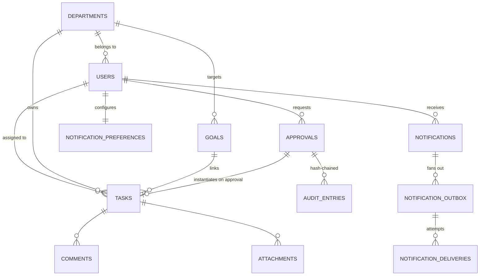

# HieraSync AI — Database Design

*Covers Slide 14 (Firestore schema, documents, subcollections) plus the engineering layer that makes the schema safe to change.*

---

## 1. Model choice: document store, not relational

The deck specifies **Cloud Firestore**. Rationale we keep and extend: heterogeneous workflow documents (a `leave` request and a `purchase` request share a collection but not a shape), schema-on-read evolution per module slice, serverless scaling with no DBA, and native subcollections for task threads.

v2 adds a **driver abstraction** so the same business code runs on two interchangeable back-ends:

| | `DATABASE_BACKEND=firestore` | `DATABASE_BACKEND=sqlite` (default in dev/CI) |
|---|---|---|
| Engine | Cloud Firestore via Admin SDK | SQLite + JSON documents (`app/db/store.py`) |
| Query surface | `collection().where().order_by().limit().stream()` | identical surface, incl. `FieldFilter`, dotted-path `update()`, `batch()`, `transaction()` |
| Indexes | composite indexes required for multi-field equality+order | none required (collection scan + in-memory sort) |
| Consistency | eventual reads, strong writes | ACID single-file, `BEGIN IMMEDIATE` |
| When | production | offline dev, demos, `pytest` (no credentials, no network) |

Chosen because a project submission must be *runnable by a reviewer in 60 seconds*, and because Firestore credentials in a repo are a security anti-pattern. One env var switches modes; no code path forks.

## 2. Collections (document dictionary)

| Collection | Key | Fields (canonical names per Slide 14) | Notes |
|---|---|---|---|
| `users` | user id | `id, name, email, hashed_password, role, department_id, designation, area_of_interest, joining_date, association, avatar_url, status, phone` | `phone` added for SMS/WhatsApp; E.164 normalised on write |
| `departments` | dept id | `id, name, code, hod_id, created_at` | `hod_id` drives approval routing |
| `tasks` | task id | `id, title, description, category, priority, status, progress_pct, progress, deadline, start_date, created_at, updated_at, completed_at, assigned_id, assignee_id, assigned, creator_id, department_id, goal_id, subtasks[], require_approval, estimated_effort, is_recurring, recurrence_pattern, blocked, blocked_by[], source, approval_id` + risk block below | `progress` (string, v1 UI) and `progress_pct` (number, deck) kept in sync by `db/compat.py` |
| ↳ risk block | | `risk_score, risk_level, risk_factors[], risk_drivers[], delay_probability, risk_explanation, risk_recommended_action, risk_projected_completion, risk_assessed_at` | written by the sweep so lists/Kanban render without recompute |
| `approvals` | `apr_*` | `id, title, kind, description, requester_id, requester_name, department_id, amount, evidence{}, priority, status, stage, stage_index, stages[], sla_hours, approver_role, hod_id, principal_id, related_task_id, hod_comment, principal_comment, decision, decision_note, decided_by, decided_at, closed_at, resubmissions, escalation_count, delegated_to/from, sla_reminded_at, audit[], missing_evidence, workflow_version` | `audit[]` is the hash-chained decision ledger |
| `events` | `evt_*` | `id, title, type/event_type, date, start_time, end_time, location, person, organizer, organizer_id, department_id, creator_id, description, reminded_at` | aliases keep v1 FullCalendar and deck naming both valid |
| `notifications` | `notif_*` | `id, user_id, title, message, type, severity, priority, icon, status, target_route, time, is_read, facts{}, meta{}, created_at` | `user_id="department"` is the broadcast pseudo-recipient (all active HOD/Principal/Admin) |
| `notification_outbox` | `obx_*` | `id, user_id, channel, address, kind, severity, subject, text, html, fingerprint, status(pending/scheduled/retry/sent/dead), attempts, max_attempts, created_at, updated_at, scheduled_at, next_attempt_at, sent_at, defer_reason, provider, external_id, last_error, meta{}` | durable send queue; per-channel dedupe key |
| `notification_deliveries` | `dlv_*` | `id, outbox_id, user_id, channel, provider, address, kind, severity, status(sent/simulated/retry/dead), ok, simulated, error, external_id, latency_ms, attempts, created_at` | audit + `/metrics` automation KPIs |
| `notification_preferences` | = user id | `email, phone, whatsapp_number, email_enabled, sms_enabled, whatsapp_enabled, whatsapp_opt_in, quiet_hours_enabled, quiet_hours, digest_mode, min_severity_email/sms/whatsapp, muted_kinds[], updated_at` | consent + per-user routing |
| `goals` | `goal_*` | `id, title, category, department_id, owner_id, target_date, milestones[{id,title,done}], progress, created_at` | milestone ratio feeds risk + check-ins |
| `comments/`, `attachments/` | task-scoped | `task_id, user_id, text, mentions[], created_at` / `task_id, filename, url, size, uploaded_by, uploaded_at` | v1 subcollection-style collections kept flat for portability |
| `risk_weights` | `global` | `weights{factor→w}, samples, auc_before, auc_after, gain, calibrated_at, updated_by, source` | per-institution calibrated profile |
| `risk_snapshots` | `snap_*` | `taken_at, bands{LOW,MEDIUM,HIGH}, open_tasks, mean_risk, at_risk, expected_misses` | trend charts |
| `activity_logs` | `act_*` | `user_id, user_name, action, category, details, timestamp` | human-readable journal |
| `reports` | `rep_YYYYMMDD` | `title, kind, generated_at, summary{tasks,risk,approvals,workload}, insights[], top_risks[]` | weekly auto-report |
| `scheduler_runs` | `job:slot` | `job_id, slot, claimed_at, finished_at, result` | idempotency claim per run slot |
| `join_requests`, `task_requests`, `settings`, `seed_meta` | id | onboarding, request-to-task flow, per-user toggles, seed marker | unchanged from v1 |

## 3. ER model (logical)

## 4. Integrity, indexes and access patterns

* **Indexes (Firestore).** `tasks: (department_id, status)`, `tasks: (assigned_id, status)`, `notifications: (user_id, is_read)`, `notification_outbox: (status, next_attempt_at)`, `approvals: (status, stage)`, `activity_logs: (timestamp)`. The embedded store needs none; they exist for the cloud driver, where a multi-field equality+sort query otherwise fails without a composite index.
* **Write-path discipline.** Documents are written through `db/compat.py` normalizers so alias drift (`progress` vs `progress_pct`, `assigned_id` vs `assignee_id`) cannot appear; the id is stored **both** as the document key and inside the body (v1 code reads `doc["id"]`).
* **Immutability where it matters.** `approvals.audit[]` entries are append-only and each carries `prev_hash` + `sha256(prev_hash + canonical_json(entry))`; `POST /api/v1/workflow/verify` recomputes every chain institution-wide.
* **Data lifecycle.** `retention_purge` (02:00) deletes delivery rows and read notifications older than `NOTIFY_RETENTION_DAYS` (90 d) — a stated privacy position, not an accident.
* **Tenancy note.** `department_id` on `users`, `tasks`, `approvals`, `goals` and `events` is what makes the multi-department roadmap (`docs/07`) additive rather than a rewrite.

## 5. Query hot paths (measured on the embedded store, seeded corpus)

| Endpoint | Work done | Notes |
|---|---|---|
| `GET /tasks/` | 1 collection scan + O(n) context build + n assessments | one `build_context()` per request (not per task) — the v1 O(n²) pattern is gone |
| `GET /risk/board` | same, filtered to active, top-N | assessments are pure CPU, ~0.1 ms/task |
| `GET /metrics/scorecard` | 4 collection scans (tasks, users, approvals, deliveries) | single pass per collection, no N+1 |
| `POST /channels/flush` | outbox rows due → provider send | batched, `limit` bounded, retried via `next_attempt_at` |
