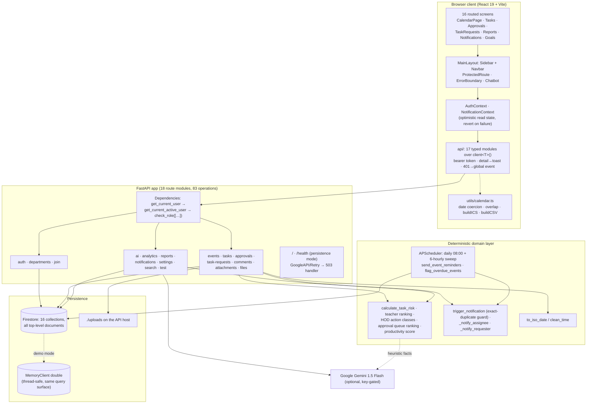
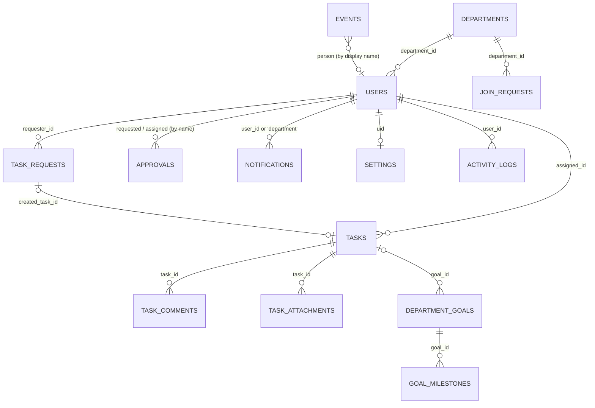
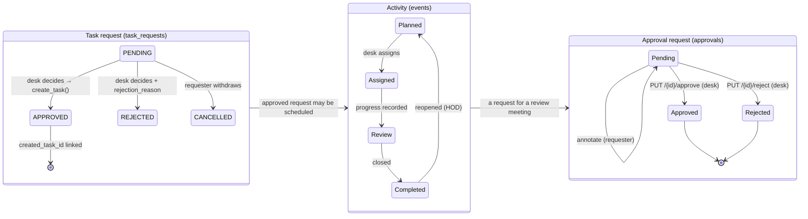
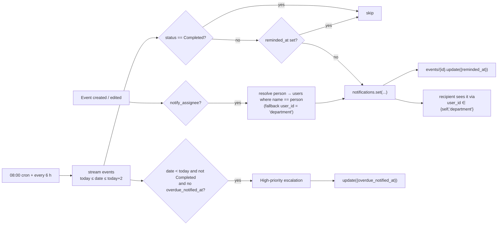

# HiéraSync AI: A Role-Aware Departmental Coordination System with a Deterministic Calendar Core, a Heuristic Risk Layer, and a Human-in-the-Loop Approval Desk

**[Author Name]¹, [Co-author Name]¹, [Guide Name]¹**
(1) [Department / Institute Name], [City], [Country]
Correspondence: [email] · **Date:** [submission date]

> **Body length (measured, not estimated):** 8 263 words in sections 1–9, counting
> table prose and excluding fenced code and the mermaid sources. Per section —
> Abstract 458 · §1 798 · §2 1 074 · §3 942 · §4 2 229 · §5 732 · §6 1 517 ·
> §7 464 · §8 347 · §9 160. Appendices: A 453 · B 181 · C 233 · D 324 ·
> References 457. Delete this block before submission; it exists so that a
> reviewer can check the draft against the word limits in your rubric instead of
> trusting a claim.

## Abstract

Departmental coordination in an Indian engineering college is usually run through
WhatsApp groups, a shared Excel calendar and paper circular notes signed at the
HOD's desk. This paper reports the design, implementation and verification of
**HiéraSync AI**, a web platform that replaces those three channels with one
role-scoped system for a single academic department. The backend is FastAPI
(36 Python modules, 5 287 lines) over Cloud Firestore, exposing 83 operations in
18 route modules over 16 collections; the frontend is React 19 + Vite +
FullCalendar (57 TypeScript/TSX modules, 10 767 lines, 8 129 lines of CSS)
behind 16 routed screens and a design-token layer that keeps typography and
alignment uniform across them. Ten server-side roles gate every write; the
calendar is the primary object, with five activity types, a four-state status
flow, ISO-date normalisation on both tiers, and hand-written ICS and CSV export
that obey RFC 5545 line folding.

The "AI" layer is deliberately **heuristic first, generative second**: an
additive, capped deadline-risk score, a two-band priority ranking for faculty
and a four-class action queue for the HOD are computed from stored documents
with no model call at all, and a Gemini request is used only to rewrite the
prose of a calendar summary when an API key happens to be configured. Every one
of the six `/ai` routes answers with no key present. Reminders come from a rule
engine (APScheduler, 08:00 daily plus a six-hourly sweep) that writes
idempotence markers onto the activity document. Two properties that a demo of
this kind usually fakes are built in and tested: a Firestore-compatible
in-memory double that makes the whole system runnable with no cloud project
`GET /health` reports which mode it is in; and an explicit first-admin
bootstrap rule that breaks the "you need a HOD to create the first HOD"
deadlock. A case-insensitive email lookup fixes a class of lockouts that no
feature test would have caught.

Verification reported here is limited to what the repository can prove: 82
pytest cases (198 assertions) over the API surface, RBAC, both approval queues,
the risk model and the reminder jobs, plus 9 `node:test` cases (46 assertions)
over the date and ICS utilities — 91 checks, all passing, in under seven
seconds, with no cloud account. Every measured number in this paper comes from
that run or from counting the tree. **No human-subject study is reported:**
Appendix A specifies the instrumented protocol (task time, SUS, Kendall's τ
between the risk score and an expert ranking, p50/p95 latency at three corpus
sizes) to be executed before submission, and §6.4 lists precisely which
convincing-sounding claims this draft therefore refuses to make.

**Keywords:** academic workflow management; department administration; role-based
access control; Firestore; explainable heuristics; deadline risk; notification
idempotence; RFC 5545; FullCalendar; reproducible evaluation

---

## 1. Introduction

### 1.1 The setting

A small department — one programme, ten to twenty faculty, one HOD desk, one
principal's office — runs an outsized amount of its administration by hand. A
"course file verification on Thursday" exists in a WhatsApp thread; the person
responsible may or may not have seen it. A request for a workshop budget is a
printed form that sits in a tray, and whether it moved is only known by asking.
A task assigned three weeks ago has no owner-visible clock. When the HOD wants
to know who is carrying the most work, somebody rebuilds a spreadsheet. Nothing
is *wrong* with the people in this loop; the medium is what fails — a chat
stream has no state, a paper tray has no queue discipline, and a spreadsheet has
no owner.

Commercial and research systems address fragments of this. Campus-wide suites treat a department as a reporting unit rather than an actor; research
schedulers such as ScheduleMe and Togedule concentrate on the meeting itself;
generative assistants for university administration report large workload
reductions but assume integrations and a data layer that a small department does not have. §2
positions the work against all three. This paper describes what we built instead:
a system scoped to one department, deployable on a free-tier Firestore project,
whose "intelligence" is mostly deterministic arithmetic and whose generative
component is optional by construction.

### 1.2 Design stance

Four positions shaped the implementation, and each is testable rather than
rhetorical.

**Deterministic first.** Ranking, escalation and summarisation must be
reproducible from stored state, so a reviewer can re-derive any number on
screen with no network and no API key. A model is allowed to *phrase* a finding,
never to *be* the finding. This follows the external evidence rather than taste:
the ICAPS survey of LLM-based planners reports that they still trail symbolic
solvers on correctness and completeness (§2.2).

**State where a message used to be.** A reminder is not a chat message; it is a
field on the activity document (`reminded_at`) so that it cannot fire twice. A
decision is not a reply; it is a status transition that queues a notification
back to the requester.

**Visibility is a server rule, not a UI courtesy.** Every route resolves the
caller from a bearer token and either requires a role or filters by identity in
the query; the client's `canManage` flag only decides whether a button is drawn.

**Degradation must be legible.** A page showing seeded sample data says so
("Offline preview data"), and `/health` reports `memory (volatile demo data)`
rather than pretending to be backed by Firestore.

### 1.3 Contributions

This paper contributes the following, each traceable to code in `github.com/Atulgupta07/Hiera_Sync` (Appendix B pins the tree and the commands to rebuild it) and, where stated, to an automated check:

1. **A department-scoped coordination data model** over a document store: 16
   collections covering identity, membership-by-invite-code, calendar
   activities, tasks with subtasks, two distinct approval queues, notifications,
   comments, attachments, goals with milestones, per-user preferences and an
   audit log — with the ten-role model enforced through per-route allow-lists
   (§4.2, §4.3).
2. **A heuristic, explainable prioritisation layer**: an additive capped risk
   score, a rank formula for "what should I do today", a four-class action queue
   for the desk, a queue-ranking rule for pending approvals, and a weighted
   faculty productivity score, each emitting the reasons behind its own number
   (§4.4). A test suite pins the arithmetic, including its floor and cap.
3. **An optional-LLM boundary**: five of six AI endpoints never call a model;
   the sixth rewrites heuristic facts into prose only when `GEMINI_API_KEY` is
   set, and says which source it used (`source: heuristic|gemini`). The
   invariant "the `/ai` prefix works with no credentials" is an executable test
   (§4.5).
4. **A rule-based reminder engine with per-document idempotence** and a
   two-tier date-normalisation contract, which together make an activity written
   as "05 August 2026" behave like one written as `2026-08-05` in filters,
   sorting, the calendar grid and the exported `.ics` (§4.3, §4.6).
5. **Operational honesty as a feature**: an in-memory Firestore-compatible
   double selected by a real readiness probe, a first-admin bootstrap rule, and
   case-insensitive credential lookup — three defects that made the system
   unusable in practice, each fixed and now covered by tests (§6.2).
6. **A verification harness that ships in the repository** (82 backend cases,
   9 frontend cases) and a written protocol for the user study that has *not*
   been run (§6, Appendix A), so the gap between "built" and "evaluated" is
   explicit rather than papered over.

### 1.4 Scope and reading order

This is a system paper: it reports design, implementation and software
verification. Appendix A is the evaluation instrument to be filled in. Appendix B
gives the commands to reproduce everything. Readers who want the comparison with
prior work can go straight to §2.6 and Appendix C.

---

## 2. Related work

### 2.1 Department and academic-affairs information systems

The closest published system to ours is the **Academic Affairs Management System** [1]: role-based
dashboards for Employee, HOD, Principal and Admin, a multi-stage document approval chain with real-time
status synchronisation, AI-assisted document summarisation, and a React/Tailwind front end. It frames the
institutional problem well and is the natural baseline for "what such a system already contains". Its
unit of work, however, is a *document* travelling up a chain. In HiéraSync the unit of work is a *dated
activity with an owner*, and the approval step is one transition on that record rather than the whole
data model. **Formal document approval workflows in higher education** [2] take the more rigorous route of
modelling the chain as a business process with rules, validation and an audit trail; we adopt that
discipline for state transitions and activity logs, but not for a multi-office signature sequence, which in
a single department adds latency without adding assurance. Two studies measure the practical benefit of
this class of system: a budget-request tracking and approval platform reported improvements in processing
time, error frequency and usability on a validated questionnaire (Cronbach's α = 0.90) [3], and a
design-science development of digital academic services reduced a thesis-registration cycle "from several
days to minutes" [4]. Commercial and open-source platforms — SAP SLCM, Fedena, OpenEduCat, EduSec — are
surveyed within [1]; all are student-record-centric, and their approval modules are record-keeping rather
than coordination surfaces. Simpler web implementations of the same problem space — a Django-based
student-management system [5] and a layered smart-campus architecture with cloud deployment and secure
authentication [6] — are useful as "conventional approach" comparators: relational schemas, no calendar
engine, no suggestion layer. A recent AI-enabled information system for challenge-based capstone matching [27]
shows the same full-stack pattern applied to a different university unit.

### 2.2 Calendar and scheduling assistance

Recent scheduling research is largely conversational. **ScheduleMe** [7] coordinates specialised agents —
event creation, availability checking, conflict resolution — under a supervisory agent over Google
Calendar, and reports the privacy exposure inherent in sending calendar text to a hosted model; that
exposure applies unchanged to any assistant with department data, which is why HiéraSync keeps the model
out of the write path. **Togedule** [8] uses an LLM to adapt *which* candidate meeting slots are shown and
in *which* presentation, recommending a final time from attendee priorities; a formative study (N=10) and
two controlled experiments (N=66) show reduced cognitive load for attendees and faster, better-organised
decisions. This is the closest published analogue to our approval ranking, with the difference that Togedule
optimises slot choice for a meeting while we rank a queue of pending decisions. **Automated scheduling for
thematic coherence in conferences** [9] formalises the trade-off we implement informally: hard constraints
(no double-booking, room capacity) versus soft ones (preferences, coherence), solved with a CSP model over
NLP-derived similarity. **The ICAPS survey of LLMs for automated planning and scheduling** [10] is the
cautionary reference: across 53 papers, LLM-generated plans remain weak on validity, completeness and
optimality relative to combinatorial planners. Our architecture follows that evidence literally — the
deterministic checker owns correctness, the model owns phrasing.

### 2.3 Workload, fairness and duty allocation

Timetable-generation work supplies the load-balancing vocabulary. An AI-based real-time timetable and
faculty scheduling system explicitly describes calendar views, conflict alerts and **heat maps for faculty
load** with a feedback loop for continuous refinement [11]; an adaptive scheduler generates timetables with a
genetic algorithm over faculty availability and subject preferences, collects feedback and exports the
result [12]. A quantified workload-balance model validated on institutional data [13] supports equity
claims that a dashboard alone cannot justify, and a learning-based system for allocating examination duty
[14] demonstrates the feature set we mirror — prior duty count, experience, availability, leave status and
expressed preference.

### 2.4 Generative AI in academic administration

**LLM agents for education** [15] surveys pedagogical and domain-specific agents and names the deployment
barriers we design against: hallucination, over-reliance, and integration with existing institutional
ecosystems. A parallel review of educational agents covers the ethics and governance layer expected of any
assistant that touches staff records [16]. The strongest measurement template is the deployment study of
GenAI assistants in a university's administrative service [17]: query volumes before and after
introduction, accuracy stratified by query complexity, and the conclusion that such assistants act as an
*augmentative* resource rather than an autonomous decision-maker. Institutional-level evidence pools
substantial reported gains — administrative-workload reduction near 62 %, task-completion time cuts above
50 %, roughly 70 % of assessment-related processes automated — alongside the barriers of privacy,
infrastructure and cultural resistance [18]. Retrieval-augmented academic analytics [19] shows BI data
being queried in natural language, which is the same loop our dashboard-summary and calendar-insight
endpoints close. Complementary evidence concerns notification design: a field experiment (N=247) found
that reducing notification-caused interruptions improves performance and lowers strain, and that
*batching* outperforms total silencing, which raises anxiety [20].

### 2.5 Stack justification and evaluation instruments

Firestore's own characterisation — stable notification latency as Listen connections grow, commit latency
governed by document and field *size* rather than field *count* — is documented in a peer-reviewed
industrial paper [21]. Head-to-head Firestore-versus-MySQL benchmarking [22] gives the trade-off honestly:
roughly 25 versus 45 write operations per second, ~$1.30 versus ~$35 for a one-million-object scenario, and
66.7 s versus 0.9 s for a million-document range scan, concluding that a document store is preferable for
growth and cost while losing on wide range queries; a study of Firestore data-modelling practice [23]
shows pre-computed aggregates reduce read counts, cost and response size. For access control in academic
platforms, RBAC hierarchies separating read-only, editing and administering roles are argued specifically
for university digital systems [24]. For evaluation, a systematic mapping of 30 Springer-indexed information-
system papers (2021–2025) documents how the System Usability Scale is applied, with respondent counts and
typical score ranges [25], and an SUS study of a higher-education audit system demonstrates comparison
against older academic platforms [26].

### 2.6 Gap

Across these bodies of work the split is clean: scheduling systems model *when*, document systems model
*what was decided*, workload allocation models *who*, and GenAI deployments model *how to answer a
question*. None of the surveyed systems holds all four in one store with one permission model and one
decision surface, and none reports a cold-start protocol for the case where the department that must be
approved by a HOD has no HOD yet. That intersection is what this paper describes.

---

---

## 3. Problem analysis and requirements

### 3.1 Failure modes of the manual practice

Six concrete failures motivated specific mechanisms. They are practitioner
observations from the department the system was built for, not instrumented
measurements — Appendix A is where a measured baseline would come from.

* **Lost-visibility.** A circular in a chat group has no per-recipient state, so
  "did you see it?" and "did you do it?" are the same question, and both are
  unanswered. → notifications carry a `target_route` and read state.
* **Ownerless due dates.** A task written on paper has no derived urgency, so
  everything is equally urgent and therefore none of it is. → the risk score.
* **Queue invisibility.** Pending approvals are invisible to the requester; the
  HOD's desk has no ordering. → both queues expose status, timestamps and a
  ranked suggestion list.
* **Date-format drift.** An Excel column that holds "05 August 2026" beside
  "2026-08-05" cannot be sorted or filtered; in our first implementation it
  also silently blanked the calendar grid. → two-tier normalisation (§4.3).
* **Bootstrap deadlock.** Whoever registers first needs approval from a person
  who does not exist yet. → the first-department claim rule (§4.3).
* **Credential casing.** A profile saved as `Hod@SBJIT.edu.in` failed a
  lowercase login with a message that blamed the password. → normalised write,
  tolerant read (§5).

### 3.2 Functional requirements

No prior requirements document existed; the list below is reconstructed from the
implemented routes and the failures that drove them, which makes it a
*reverse-engineered* specification. That is stated openly because it bounds what
§6 can claim: the system satisfies its own requirements, not a customer's.

* **FR1 Identity.** Self-registration with name, email, password and role;
  bearer-token sign-in; profile read; password-reset link generation.
* **FR2 Account provisioning.** The desk (ADMIN/HOD) creates and edits accounts,
  with search across name, area of interest and designation.
* **FR3 Department lifecycle.** Create a department, receive a unique 8-character
  invite code, regenerate that code, read one's own department.
* **FR4 Membership approval.** Request to join by code; the department's HOD
  approves or rejects; approval writes `department_id` and `status: ACTIVE` in
  one update and notifies the requester.
* **FR5 Calendar as the primary object.** Create/edit/delete department
  activities with type, responsible faculty, venue, all-day flag, times, status
  and priority; list with `type`, `person`, `date_from`, `date_to` filters; a
  validated time range; explicit clearing of optional fields.
* **FR6 Directed reminders.** Notify the named owner when an activity is created
  (`notify_assignee`) or on demand (`POST /events/{id}/remind`).
* **FR7 Unattended reminders.** A scheduled sweep queues a message for every
  activity starting within two days and escalates overdue ones, each at most
  once, and skips completed work.
* **FR8 Task tracking.** Tasks with assignee, deadline, priority, progress,
  category, effort estimate, reminder text, subtasks and a `require_approval`
  flag; update and delete; assignment notifies the assignee and writes an audit
  entry.
* **FR9 Request-to-work conversion.** Any active user raises a task request; the
  desk approves it into a real task (optionally editing title, assignee,
  deadline and priority inline) or rejects it with a reason; the requester can
  withdraw while pending.
* **FR10 Approvals desk.** A flat queue with priority, comments and decision
  timestamps; approve/reject restricted to the desk; the requester is notified
  by name resolution.
* **FR11 Discussion and evidence.** Threaded comments on a task with @-mentions
  that fan out notifications; per-task file attachments plus a general upload /
  list / metadata-download endpoint.
* **FR12 Goals, dashboards and portability.** Department goals with ordered
  milestones; dashboard and analytics aggregates; a personal notification feed
  with read/unread and bulk actions; four preference toggles; cross-collection
  search; ICS and CSV export of exactly the rows currently in view.

### 3.3 Non-functional requirements

* **NFR1 Server-side authorisation**, with the client mirroring rules only to
  avoid dead buttons.
* **NFR2 Data fidelity**: every stored date is ISO on both tiers; a field can be
  emptied, not merely overwritten.
* **NFR3 Operability**: the system must run and be demonstrable with no cloud
  credentials, and must always say which persistence it is on.
* **NFR4 Explainability**: each computed score arrives with the reasons that
  produced it.
* **NFR5 Portability**: exports must parse in mainstream clients (RFC 5545
  folding, RFC 4180 quoting).
* **NFR6 Model-independence**: no route may require an LLM key to return a useful
  answer.
* **NFR7 Idempotence**: repeated reminders, repeated decisions and repeated
  notification writes must not multiply state.

### 3.4 Requirement traceability

**Table I** maps each requirement to the code that implements it. Paths are
relative to `/api/v1` unless noted.

**Table I. Requirement → implementation.**

| Req | Backend | Frontend / other | Checked by |
|---|---|---|---|
| FR1 | `POST /auth/register`, `POST /auth/login`, `GET /auth/me`, `POST /auth/forgot-password` | `api/auth.ts`, `pages/Auth/*` | `test_api_surface.py` (4 cases) |
| FR2 | `GET/POST /auth/employees`, `PUT /auth/employees/{id}` | `pages/Employees.tsx`, `api/employees.ts` | 2 cases |
| FR3 | `POST /departments`, `GET /departments/me`, `PUT /departments/code` | `pages/CreateDepartment.tsx` | 1 case (gate) |
| FR4 | `/join/request`, `/join/{status,pending,approved,rejected}`, `/join/{id}/{approve,reject}` | `pages/JoinDepartment.tsx` | 1 case + manual walkthrough |
| FR5 | `/events` CRUD + query filters | `pages/CalendarPage.tsx`, `utils/calendar.ts` | 7 cases |
| FR6 | `POST /events/{id}/remind`, `notify_assignee` on create | day-detail modal | 2 cases |
| FR7 | `app/scheduler/jobs.py` (cron 08:00 + 6 h interval) | — | 3 cases |
| FR8 | `/tasks` CRUD, `calculate_task_risk`, `activity_logs` write | `pages/Tasks.tsx` + role dashboards | 4 cases |
| FR9 | `/task-requests` POST/GET, `/{id}/approve`, `api_route(["PATCH","PUT"])` | `pages/TaskRequests.tsx` | 4 cases |
| FR10 | `/approvals` CRUD + `/{id}/{approve,reject}` | `pages/Approvals.tsx` | 4 cases |
| FR11 | `/comments/{task_id}`, `/attachments/{task_id}`, `/files/{upload,,download/{id}}` | `components/tasks/Task*`, `FileUpload.tsx` | manual |
| FR12 | `/goals…` (8 routes), `/reports/*`, `/notifications/*`, `/settings/*`, `/search`, `/analytics/faculty-performance` | ICS/CSV export in `utils/calendar.ts` | 9 cases |

---

## 4. System design

### 4.1 Architecture

Fig. 1 shows the four bands a request crosses. Nothing in the diagram is
aspirational: each box is a directory in the repository.



**Fig. 1.** Layered structure of HiéraSync AI. The optional Gemini edge is the
only outbound dependency; every other arrow is in-repo code.

Two structural notes. First, **there is no service layer**: routers import each
other directly (`ai.py` imports `calculate_task_risk` from `tasks.py`;
`requests.py` imports `create_task` from `tasks.py`) rather than going through a
`services/` package. That keeps reuse concrete and dependency-light at 5.3 k
lines, and it is the debt §8 asks to pay back. Second, **every collection is
top-level** (`events`, `tasks`, `approvals`, …). Department isolation is
therefore a query-time predicate, not a document path — a choice with
consequences for both RBAC and scalability (§6.4).

### 4.2 Coordination state

**Table II** lists the 16 collections the application reads or writes. All
document ids are either the Firebase `uid`, a `uuid4`, or a short prefixed token
(`notif_`, `evt_seed_`, `app_seed_`). Timestamps are stored as ISO strings via
`datetime.utcnow().isoformat()` — no server-side timestamps, no transactions,
no batched writes.

**Table II. Persistence model (16 collections).**

| Collection | Key | Carries | Written by | Read gating |
|---|---|---|---|---|
| `users` | Firebase uid / `demo_<12 hex>` | name, email (normalised), `hashed_password`, `role`, `department_id`, `designation`, `status` | register, `POST/PUT /auth/employees`, join approval, `grant_access.py`, first-department bootstrap | profile self; list to any active user |
| `departments` | uuid | name, unique 8-char `code`, `hod_id`, `is_hod` | `POST /departments`, `PUT /departments/code` | own department |
| `join_requests` | uuid | `faculty_id`, `department_id`, `department_code`, `status` ∈ Pending/Approved/Rejected, `requested_at` | `POST /join/request`; decision routes | requester's own; desk sees its department's |
| `events` | uuid (or `evt_seed_n`) | 12 schema fields (§4.3), plus `reminded_at`, `overdue_notified_at`, `creator_id`, `created_at` | `POST/PUT/DELETE /events` (desk only); scheduler markers | any active user, filtered |
| `tasks` | uuid | 17 schema fields incl. `subtasks[]`, `reminder`, `require_approval`, `goal_id`, `progress`, `deadline` | `POST/PUT/DELETE /tasks` (desk only) | FACULTY sees only tasks whose `assigned_id` matches or whose `assigned` text contains their name |
| `approvals` | uuid | `title`, `requested`, `assigned`, `priority`, `status`, `comments`, `created_at`, `reviewed_at` | `POST/PUT/DELETE /approvals` | any active user (list is department-wide) |
| `task_requests` | uuid | request fields + `requester_id`, `status` ∈ PENDING/APPROVED/REJECTED/CANCELLED, `rejection_reason`, `created_task_id`, `reviewed_by` | `POST /task-requests`, decision routes | own for faculty, all for desk |
| `notifications` | `notif_<8 hex>` | `user_id` (or `"department"`), `title`, `message`, free-form `type`, `priority`, `target_route`, `icon`, `status`, `is_read`, `created_at` | 5 fan-out sites + `POST /notifications` | `user_id ∈ {self, "department"}` |
| `task_comments` | uuid | `task_id`, `author_id/name`, `content`, `mentions[]` | `POST /comments/{task_id}` | task participants |
| `task_attachments` | uuid | `task_id`, `file_name/type/size`, `storage_path`, `uploaded_by` | `POST /attachments/{task_id}` | task participants |
| `files` | uuid | `filename`, `safe_filename`, `file_path`, size, `content_type`, `uploader_id/name` | `POST /files/upload` (bytes to `./uploads`) | any active user |
| `department_goals` | uuid | title, description, category, start/target date, `owner_id`, status | `POST/PATCH/DELETE /goals` | any active user reads |
| `goal_milestones` | uuid | `goal_id`, title, description, `due_date`, `order`, `status`, `completed_at` | milestone routes (desk only) | nested into goal reads |
| `settings` | uid | four booleans (`ai_recommendation`, `task_analysis`, `deadline_alert`, `email_notifications`) | lazily on first read; `PUT /settings/me` | self |
| `activity_logs` | auto | `user_id/name`, `action`, `category`, `details`, `timestamp` | `create_task` only | latest 5, any active user |
| `test` | auto | `POST /test/firebase` probe record | dev probe | dev probe |

Identity is carried in the JWT as `sub = email`, signed HS256 with
`ACCESS_TOKEN_EXPIRE_MINUTES` (30 by default; `.env.example` ships 60). Because
the subject is the email and not the uid, changing an address invalidates live
tokens — accepted deliberately so that a profile rename cannot leave two
identities in flight, and recorded in §6.4 as a constraint.



**Fig. 2.** Referential structure. Dashed-by-nature edges are the ones held by
*display name* rather than id — `approvals.requested`, `tasks.assigned` as a
fallback, and `events.person` — which is precisely where the name-based lookups
in §4.3 and the fragility noted in §6.4 come from.

### 4.3 Coordination rules

**Activity lifecycle.** `EventCreate` accepts 12 fields (`title`, `date`,
`type`, `person`, `description`, `location`, `status`, `priority`, `start_time`,
`end_time`, `all_day`, `notify_assignee`). `type` is drawn from five values
(Academic, Meeting, Workshop, Department Activity, Research), `status` from a
four-state flow (**Planned → Assigned → Review → Completed**) and `priority`
from Low/Medium/High, all declared once in `app/schemas/schemas.py` and mirrored
in `pages/calendarData.ts` so the UI stepper and the API agree. Writes require
ADMIN or HOD (`MANAGE_ROLES`); reads are open to any active user. A timed
activity whose `end_time` is not after `start_time` is rejected with 422, and
`CLEARABLE = {description, location, start_time, end_time}` makes an empty string
an explicit *clear* rather than an ignored field. On a first read of an empty
collection the API materialises eight sample activities relative to today's
date — as real documents, so they can be edited and deleted instead of
re-appearing forever.



**Fig. 3.** The three state machines that a department actually runs on. Only
the left one is a calendar object; the middle one is a decision, the right one
converts into work.

**Two approval queues, deliberately different.** `approvals` is a flat desk
queue: `Pending → Approved|Rejected`, one reviewer stage, with the requester
allowed to annotate their own pending item and to withdraw it; a decision that
does not change the value returns the document untouched, so a double-click
cannot re-notify. `task_requests` is a *conversion* queue: `PENDING →
APPROVED|REJECTED|CANCELLED`, where approval calls `create_task` in-process and
records `created_task_id`, so the notification that says "a task was created" is
true; approving an already-decided request is a 400, not a silent no-op.
`models/models.py` also declares `ApprovalStatusEnum` with a two-stage
`PENDING → APPROVED_HOD → APPROVED_PRINCIPAL` chain and a `current_stage`
field; no route uses it, which we record as an unfinished capability rather than
a feature (§6.4).

**Membership.** A department is created with a unique 8-character code from
`A–Z0–9`, regenerable by its HOD. Join requests are validated against that code,
refused if already a member, and refused while another request is pending;
approval writes `department_id` and `status: ACTIVE` in a single `update()` and
notifies. Two mechanisms exist so that the system can start at all: the **first
department may be claimed by whoever registers it even while PENDING**, and that
account is promoted to HOD in the same call; and `get_current_user` performs a
**read-repair**, re-checking a PENDING account's approved join request and
activating it. `scripts/grant_access.py` performs the same repair from the
command line when there is no UI to sign in through.

**Reminders.** `send_event_reminders()` streams `events`, keeps those with an
ISO date inside `[today, today + REMINDER_WINDOW_DAYS]` that are not `Completed`
and have no `reminded_at`, writes one notification for the resolved owner and
then stamps the marker. `flag_overdue_events()` mirrors it for dates in the
past, escalating with `priority: High` and stamping `overdue_notified_at`. The
window is a two-day horizon; cadence is a cron at 08:00 plus an interval sweep
every six hours, so worst-case latency for an activity created at 08:01 is
under six hours and the marker guarantees at-most-once per activity per
category.



**Fig. 4.** Notification fan-out and its two idempotence mechanisms: a marker on
the activity for scheduled sweeps, and an exact `(user_id, title, message)`
match inside `trigger_notification` for immediate ones.

### 4.4 The deterministic prioritisation layer

Every number on the dashboard is arithmetic over stored documents. The core is
`calculate_task_risk(task, faculty_workload)` in `app/api/v1/tasks.py`, applied
on read so that a task's risk is always current with respect to today.

**Table III. The additive risk model (capped to [5, 95] unless closed).**

| Condition | Δ | Note |
|---|---|---|
| `status ∈ {Completed, Awaiting Approval}` | → 0, level LOW | returns immediately, factor explains it |
| `days_left < 0` | +90 | factor "Task is overdue by *n* days." |
| 0 ≤ `days_left` ≤ 2 | +50 | "Only *n* days remaining." |
| 3 ≤ `days_left` ≤ 5 | +30 | "*n* days remaining." |
| `progress` < 50 % **and** `days_left` ≤ 3 | +25 | "Progress is only *x*%." |
| `priority == High` | +15 | "…less margin for error." |
| `faculty_workload` > 3 | +20 | "*k* active tasks" |
| unparseable/absent deadline | — | `days_left` defaults to 10 |
| after summation | `min(max(s, 5), 95)` | floor so nothing reads as zero |
| bands | > 70 HIGH, > 40 MEDIUM, else LOW | |

Three rules are then layered on top of it, all with their own explanations:

* **Faculty "today" list.** `score = 50·days_overdue + risk_score +
  (30|15|5 by priority)` plus `(4 − days_remaining)·10` when the deadline is
  within three days; items with `status ∈ {Completed, Awaiting Approval}` are
  dropped; the top five are returned with ranks assigned after sorting and a
  `why[]` list drawn from overdue-ness, imminent deadline, low progress, high
  risk and high priority.
* **HOD action queue** (ADMIN/HOD only), four classes with explicit levels:
  CRITICAL = `100 + days_overdue`; HIGH RISK = `80 + risk/10` when risk > 70;
  APPROVAL = `60` for a task awaiting approval; WORKLOAD = `50 + load` for an
  assignee holding more than four active tasks. Sorted descending, truncated to
  ten.
* **Pending-approval ranking.** `score = {urgent 70, high 60, medium 30, low 10} + min(30, age_days × 4) + 8 if no reviewer note yet`, top three returned with a composed reason string.
* **Faculty productivity** (`/analytics/faculty-performance`, desk-only):
  `0.35·on_time_rate + 0.30·completion_rate + 0.20·mean_active_progress +
  0.15·workload_balance`, where workload balance is 100 for ≤3 active tasks, 70
  for ≤5, 50 for zero (flagged as under-utilised) and `max(0, 100 − 10·load)`
  beyond that. `average_completion_time` is returned as `null` on purpose:
  completion is not timestamped, so the field would be a lie.

Fig. 5 draws the same rules as bands, so that the clamp, the floor and the two level lines are visible without reading the table; the figure doubles as the specification for a hand-drawn version (Appendix D).

**Fig. 5.** The risk model of Table III as score bands: each rule's increment stacked left to right, cut off at the 95 cap, with the 5 floor and the 40/70 level thresholds marked.

Four figures the eye reads as measurements are **not** measurements, and we say
so rather than leaving a reviewer to find it: `ai_productivity` "92 %" and
`ai_efficiency` "92 %" are string literals in the response builders; the
dashboard's `productivity_score` is the literal "95 %"; the greeting is always
"Good Morning, *name*"; and the counters in `/reports/dashboard-stats` fall back
to `124`, `18`, `5`, `24`, `18`, `9` and `2` when a collection is empty. Each is
pinned by a characterisation test so that turning a placeholder into a real
metric will break the test and force a sentence in the paper.

### 4.5 The LLM boundary

Six routes sit under `/ai`; **five never call a model**:

* `GET /ai/dashboard-summary` — the two rankings above, from Firestore reads.
* `GET /ai/approval-suggestions` — the queue ranking, from stored priorities and
  ages.
* `POST /ai/notification-summary` — counts, a per-type histogram and up to three
  high/urgent unread titles.
* `POST /ai/generate-report` — a fixed template (title, one summary sentence,
  two recommendations) plus a fresh timestamp. It performs no aggregation; the
  paper does not describe it as if it did.
* `GET /ai/calendar-insights` — deterministic facts (activities in the next
  seven days, the busiest day, the heaviest owner, crowded days with 3+ items,
  count past their date) which *may* then be rewritten.

The rewrite is the whole extent of generative use: when `GEMINI_API_KEY` is
set, the highlight strings are handed to Gemini 1.5 Flash with an instruction to
advise the HOD or the faculty member "based only on these facts", 20 s timeout,
and on any exception the heuristic summary is returned with a warning log. The
response carries `source: "heuristic" | "gemini"` so a caller can tell which it
got. `POST /ai/chat` is a plain pass-through with no departmental context
attached, and answers "…operating in simulated mode. Please add your
GEMINI_API_KEY…" when unconfigured — an honest degradation we prefer to a
confident hallucination. The invariant is a test: all six routes return 200 with
no key configured.

### 4.6 Portability, exports and the demo double

Calendar data must leave the system. Both writers live in
`frontend/src/utils/calendar.ts` and are exercised by the shipped unit tests:

```
ICS   BEGIN:VCALENDAR · VERSION:2.0 · PRODID:-//HieraSync AI//Academic Calendar//EN
      · CALSCALE:GREGORIAN · METHOD:PUBLISH
      UID:<id>@hiera-sync · DTSTAMP:<UTC YYYYMMDDTHHMMSSZ>
      all-day: DTSTART;VALUE=DATE:<YYYYMMDD> · DTEND;VALUE=DATE:<day+1>  (exclusive)
      timed:   DTSTART:<YYYYMMDDTHHMMSS> (floating local) · DTEND from end_time, else start_time
      SUMMARY · DESCRIPTION (note · Owner: p · Type: t) · LOCATION (omitted if empty)
      escaping: backslash, then ';', then ',', newline → \n
      folding: every line to 74 chars + continuation space, CRLF between lines  (RFC 5545)
CSV   every cell quoted, embedded quotes doubled, CRLF line ends            (RFC 4180)
      columns: Date · Activity · Type · Responsible Faculty · Location · Start
               End · Priority · Status
```

Exports are scoped to the rows currently in view (`hiera-sync-calendar-<range
start>.ics|.csv`), and a single activity can be downloaded as its own `.ics`
from the day modal. Nothing about the calendar depends on the backend being
reachable.

The same reasoning produced the **demo double**: `app/database/memory.py` is a
241-line, thread-locked `MemoryClient` that implements the subset of the
Firestore surface the routers actually use (`collection().document().get() /
set(merge) / update() / delete()`, `where(field, op, value)` and
`where(filter=FieldFilter(...))`, `order_by`, `limit`, `stream`, plus `seed` and
`clear`). `init_firebase()` probes the client after initialising it and falls
back to that double on any failure, logging why; `get_db()` does the same if the
lifespan never ran; `is_memory_db()` and `GET /health` expose the state.
Combined with the calendar page's `live`/`preview` flag and its
`hiera:calendar:preview-events` `localStorage` cache, this makes the whole
product — including a reviewer's own laptop, an examination demo and the test
suite in §6.1 — runnable with no project, no key and no network. It is a
demonstration affordance, not offline synchronisation: there is no merge, no
replay, and restarting clears it.

---

## 5. Implementation

**Stack and volume.** Back end: Python 3.11, FastAPI with `uvicorn[standard]`,
Pydantic v2 (`pydantic[email]`), `firebase-admin`, `python-jose` for JWT,
APScheduler, `bcrypt` (reached through `passlib[bcrypt]`, though the code imports
`bcrypt` directly and never uses passlib). Front end: React 19.2, TypeScript 6,
Vite 8.1, Tailwind 4.3, FullCalendar 6.1 (`@fullcalendar/react` 6.1.15 with the
daygrid/timegrid/interaction plugins at 6.1.21), Recharts, Framer Motion,
dnd-kit. Application volume: 5 287 lines across 36 Python files; 10 767 lines
across 57 TS/TSX files; 8 129 lines of CSS; 18 route modules and 83 operations;
16 collections; 16 routed screens, 12 component modules and 3 layout modules.
`requirements.txt` declares nine packages **with no pins** — reproducible in
what it needs, not in what it gets; §8 treats that as debt, and Appendix B
records the exact resolution this paper's numbers came from.

**Authentication.** Sign-in compares a bcrypt hash (`gensalt()` default cost, 12
rounds) held on the caller's `users` document. Firebase Auth is used to *mint*
an account at registration (and to generate reset links) but is never consulted
at sign-in, which keeps the department database authoritative and the system
self-contained. The three failure modes are distinguished on purpose: no profile
("Incorrect email or password"), profile without a hash ("This account has no
password on file in the department database…"), and a correct password with any
casing of the address. Emails are trimmed and lowercased on write and resolved on
read through one helper that tries the typed value, the normalised value and then
a case-insensitive scan of `users`, so rows written before normalisation can
still sign in and tokens issued from them keep authenticating.

**Consistency details that turned out to matter.** Every resource route is
declared without a trailing slash, because a 307 between client and handler
drops a `PUT` body in some clients. The task-request decision route is declared
`api_route(methods=["PATCH", "PUT"])` because the generated client uses the
latter. Approval decisions and request approvals/rejections notify; task
creation writes the audit entry that the dashboard's activity rail reads. The
scheduler's sweeps are made idempotent by per-record markers (§4.3). Every one of
these came from an observed failure, not a style preference, and each is now
pinned by a named test.

**Typed client layer.** The front end reaches the API through 17 modules
(`authApi`, `eventsApi`, `tasksApi`, `approvalsApi`, `requestsApi`, `aiApi`, …)
layered on a single `client<T>()` wrapper that injects the bearer token,
JSON-encodes the body, treats `204` as an empty object, re-raises the server's
`detail` string as the message (which is why a failure on screen reads "Only the
HOD desk can reschedule activities." rather than "403"), and on `401` clears the
token and dispatches a global `unauthorized` event that `AuthContext` listens
for. Tokens go to `localStorage` when "remember me" is checked and to
`sessionStorage` otherwise; authorisation state is derived from the profile the
token resolves to via `GET /auth/me`, so a stale local role cannot open a surface
the server would refuse. In development the Vite server proxies `/api/v1` to
`127.0.0.1:8000`, so the browser stays same-origin.

**Graceful degradation, visibly.** Pages track whether they are serving `live` or
`preview` records; a failed calendar fetch flips to seeded preview data and the
toolbar says so. In preview mode mutations persist to `localStorage`; in live
mode a write is optimistic and reverted with a toast if the API rejects it, the
same pattern the notification context uses for read-state toggles.

**Design system as a usability requirement.** Tokens in `index.css` define four
variable families loaded from Google Fonts — Manrope (body), Roboto Slab
(display and numerals), Saira (labels and controls) and Google Sans Flex (data,
and the shared fallback) — plus a radius scale (4/6/8/10/12/14/16 px and
`--radius-pill: 999px`) with Tailwind's `xs…3xl` remapped onto it, which is how
"sharper bento corners everywhere" was achieved without editing 16 pages.
Alignment is a contract, not a habit: pages use `.hs-page` or the full-bleed
`.hs-shell-pad`, the layout's `<main>` carries no padding at all,
`--hs-content-max: 1440px` and `--hs-gutter` are shared, and
`scrollbar-gutter: stable` prevents a per-page horizontal jump. The calendar
carries the affordances the workflow needs: month/week/day views at 30-minute
slots, drag-to-reschedule gated by `canManage` with an optimistic update, a day
rail for the selected date, per-day density classes, a workload ranking naming the
heaviest-loaded person, a status stepper over the four lifecycle states, an
Escape-dismissable detail modal, and range-scoped `.ics`/CSV export. The task
surface splits by role into `HODDashboard` and `TeacherDashboard`, which is what
lets the same `/ai/dashboard-summary` payload serve both audiences.

---

## 6. Verification

### 6.1 What is executed, and reproducibly

Verification here means *software* verification, and only of what ships in the
repository: no number below depends on a throwaway script. Two suites, one
command each.

```
cd backend && python -m pytest -q      # 82 passed in ~6 s, no network
cd frontend && npm run test:utils      # 9 pass, 0 fail in ~0.2 s
```

**Table IV. Verification assets and what each establishes.**

| Asset | Cases | Asserts | Establishes |
|---|---|---|---|
| `tests/test_api_surface.py` | 41 (27 functions) | 60 | `/health` mode reporting; 83 operations and the prefix set; five routes 401 without a token; canonical paths answer with no redirect and no history; `PUT` bodies survive; email normalisation on write and legacy-case read fallback; duplicate registration refused; the two distinct 401 messages; `sub`-is-email roundtrip through `GET /auth/me`; self-registration trusts `role` (documented finding); the shared default password `Sbjit@123`; employee search; three 403 gates; notification scoping to `{self,'department'}`; bulk-read mutating shared rows; helper dedupe vs. raw REST write; lazy settings document; the three placeholder constants; the export URL that is never written |
| `tests/test_workflows.py` | 41 (40 functions) | 138 | desk-only event writes; ISO normalisation for four input shapes; inverted time range → 422; explicit field clearing; first-read seeding of 8 editable documents; type/person/window filters; assignment reminder reaches the named account and `/remind` answers 400 without an owner; 404 instead of 500 for a missing activity; approval round-trip with requester notification; idempotent second decision; owner annotation vs. stranger 403 vs. withdrawal; queue filter and newest-first order; request→task conversion with the task title, assignee, `created_task_id`, `reviewed_by` and the 400 on retry; per-requester visibility; owner cancel cannot approve; rejection reason + notification; task creation notifies and writes the audit log; faculty task list is assignment-scoped; risk attached on read; milestone CRUD reachable by the desk only; five risk-model cases pinning cap 95, floor 5, closed-work zero, stacking of near-deadline+stall (75 vs 50) and the workload delta (exactly 20); graceful default on junk dates |
| `frontend/tests/calendar-utils.test.mjs` | 9 | 46 | `toISODate` accepts ISO/human/junk-prefixed forms and never renders "Invalid Date"; relative-day wording; upcoming/overdue respect status; double-booking detection; the all-day exclusive `DTEND`; ICS escaping, CRLF termination and folding; `foldICSLine` folds only what it must; CSV quoting of separators and embedded quotes |
| `GET /health`, `/openapi.json` | — | — | the persistence mode and the operation count asserted above are readable by any reviewer without the source |

Total: **91 automated cases and 244 assertion statements, all passing**, in under
seven seconds on a laptop, with no cloud project, no credentials and no model
key. A separate read-only sweep of all 35 `GET` operations under `/api/v1` in
demo mode returned 28 × 200 and 7 × 404 — the 404s are the deliberately absent
document ids fed to parameterised routes — and **no 5xx** (`/` and `/health`
included). The snippet is in Appendix B.

### 6.2 Defect classes found, and what they teach

Every fix below is a commit on this branch, with the failing behaviour described
first. The classes are generic enough to be the useful part of this section.

1. **Configuration lying about identity.** `initialize_app(cred, {"projectId":
   settings.FIREBASE_PROJECT_ID})` let a stale `.env` default (`my-firebase-project`)
   point the app at an empty database: sign-in failed with "user not found"
   although the service-account file named a different project. Fixed by letting
   the credential file decide, warning on mismatch, and logging
   `Firestore project: …` at start (`9ccaf48`), plus `/health` refusing to name a
   project it is not connected to (`506bbe9`) and resolving the key path against
   `backend/` as well as the CWD (`d870b56`). *Lesson: an identity that is
   configured twice will eventually disagree with itself.*
2. **Deadlock in a permission model.** An empty Firestore project could not be
   started from the UI: registration yields a PENDING FACULTY account, only an
   active HOD can approve, and only the approval creates the HOD. Fixed by the
   first-department claim rule with immediate activation and promotion, and by
   the `get_current_user` read-repair (`2676d57`), with `scripts/grant_access.py`
   for the headless case. *Lesson: every ACL needs a bootstrap path; test the
   empty database, not the seeded one.*
3. **Case sensitivity in a human-entered key.** A profile typed as
   `Hod@SBJIT.edu.in` could not sign in, and the message blamed the password
   (`3bacfcd`); fixing only the login path would have left `get_current_user`,
   whose subject *is* the email, broken — the fix normalises on write and makes
   every read path tolerant. *Lesson: normalise at the boundary and audit every
   reader of the field.*
4. **Transport subtleties that look like logic bugs.** Trailing-slash route
   declarations made `PUT` requests arrive as 307 + bodyless reissue, so the
   request-approval buttons appeared to do nothing; `GET /api/v1/join/requests`
   404s because the resource is `/join/pending` (`cebcf44`, `f060abd`). A
   `CORS_ORIGINS` list in settings broke startup, and wildcard-plus-credentials
   is rejected by browsers (`b6b7747`). *Lesson: check the wire before checking
   the algorithm.*
5. **A format assumption in a data layer.** Calendar dates written as
   "05 August 2026" broke FullCalendar's cell matching and every range filter;
   rather than adding a validation error at the boundary, normalisation lives on
   both tiers — `to_iso_date` on the API, `toISODate` in the client — with the
   first-read seed producing only ISO (`27911f1`, now pinned by `test_activity_dates_are_normalised_on_both_tiers`). The same audit found that
   the "sample" activities were synthetic objects the UI could not edit, so the
   empty-collection path now persists real documents. *Lesson: parse at the
   edges, store one canonical form, and let demo data be real data.*
6. **Silent placeholder drift.** `reports.py`, `ai.py` and `settings.py` mix
   computed and literal values. The fix is not deletion — a demo needs a
   fallback — it is that every placeholder is now asserted, so promoting one to a
   measurement is a change that must be written up rather than slipped in.

### 6.3 Security posture as implemented

Enforced server-side: bearer token on every route but `/`, `/health`,
`/docs`, `POST /auth/register`, `POST /auth/login` and `POST /auth/forgot-password`;
allow-list role checks (`check_role`) on activity writes, task and goal writes,
both approval decisions, employee management and analytics; identity-scoping
predicates for tasks (FACULTY), task requests and join queues; owner-only
annotation and withdrawal on approvals; department-ownership checks on join
decisions and code regeneration; bcrypt (12 rounds) with a per-record salt;
`detail` strings that name the missing permission but never the caller's role in
another account; CORS restricted to an explicit origin list; a global exception
handler that converts `GoogleAPICallError`/`RetryError` into 503 without leaking
the Google payload. *Not* implemented, and therefore not claimed: rate limiting
or lockout on repeated failures; token revocation (a 30-minute TTL is the only
expiry mechanism); field-level encryption; any authorisation on
`GET /approvals` beyond "is an active user", so any authenticated account reads
the whole department queue; no Firestore security rules are shipped in the
repository, so a direct client with the web API key bypasses all of the above —
the deployment is intended to keep the API as the only client.

### 6.4 What has not been established, and what is known to be weak

This section is the honest part of the paper; a reviewer will find these
properties either way.

* **No user study.** Nothing in this draft measures whether the platform makes a
  department faster. §7's claims are about construction, not benefit.
* **No performance envelope.** All read paths stream whole collections and filter
  in Python; there is no pagination, no composite index and no cache. That is
  correct at department scale and unexamined at faculty-wide scale, where
  `GET /events` and `GET /tasks` become O(corpus) per request. Appendix A
  specifies the latency sweep at 100/1 000/10 000 activities.
* **No model evaluation.** The only generative behaviour is a prose rewrite; we
  have not measured its faithfulness, and no claim about "AI accuracy" is made.
* **Name-based identity edges.** `events.person`, `approvals.requested` and the
  fallback half of the task-scoping predicate match display names, with
  `"department"` as the catch-all when a lookup fails. Two same-named accounts
  would misroute reminders, and a renamed account orphans its history. Ids exist
  (`creator_id`, `assigned_id`, `requester_id`); the migration is future work.
* **Vocabulary drift.** Statuses and priorities are free-form strings on the
  wire, while `models.py` declares enums (four notification types, five task
  statuses, `PENDING/APPROVED_HOD/APPROVED_PRINCIPAL/REJECTED`) that the routes
  do not use; the seeded task data says "Pending Approval" while the AI layer
  filters on "Awaiting Approval", so a seeded approval-waiting task is skipped by
  the HOD queue. `POST /notifications` accepts any type string. These are
  latent defects, reported as such.
* **UI honesty gaps.** `NotificationCenter.tsx` is a 41-line mockup with two
  hard-coded rows and a permanent red dot, while the real feed is
  `pages/Notifications.tsx`; two `StatCard` components coexist; the Notifications
  page opens with a hard-coded AI sentence before the digest is fetched; the
  four preference toggles are stored and never read; the Goals page renders
  milestones read-only although the API supports full milestone CRUD;
  `@reduxjs/toolkit` and `react-redux` are declared dependencies with no store in
  `src/`; `GET /files/download/{id}` returns metadata, not bytes; the mock
  `notifications/email.py` is never called; `activity_logs` is written only by
  `create_task`.
* **Credential hygiene.** `SECRET_KEY` defaults to `"supersecretkey"` in
  `config/settings.py` if `.env` is absent; `EmployeeCreate.password` defaults to
  the shared `"Sbjit@123"`; a `.env` was tracked earlier in this project's
  history, so its `SECRET_KEY` must be rotated regardless of the current tree; any
  service-account JSON pasted into a chat or an issue must be revoked and
  reissued.

---

## 7. Uniqueness and discussion

**What is unusual here, stated as claims and nothing more.**

1. *The intelligence is inspectable.* Ranking, escalation and queue order come
   from a capped additive model whose every term, weight and band appears in
   Table III and in the `risk_factors`/`why` strings the client renders. The
   literature's caution about LLM planners (§2.2) is answered structurally: the
   model may rephrase, never decide.
2. *The LLM is optional by construction, and provably so.* Six AI routes, no key,
   five of them useful anyway, one honest refusal, and a `source` field that tells
   the caller which path ran. This is a test, not a design intent.
3. *The department can start itself.* The bootstrap rule plus read-repair plus a
   CLI script covers all three ways a first admin can arrive: through the UI,
   through an existing PENDING account, and through no UI at all.
4. *Idempotence is per-record, not per-job.* Because `reminded_at` lives on the
   activity, restarting the scheduler, re-running the sweep or adding an activity
   mid-cycle cannot produce a duplicate message. `trigger_notification` adds an
   exact-content guard for immediate fan-out, and the decision endpoint returns
   the untouched document when a decision does not change.
5. *Two kinds of approval, distinguished by their effect.* One queue records a
   decision; the other manufactures work (`created_task_id`). Naming the
   difference is what makes the "approved → task created" notification
   defensible rather than decorative.
6. *It is demonstrable where it runs.* The MemoryClient double, `live`/`preview`
   labelling, `/health`, the first-read seed and hand-written exports mean the
   artifact can be exercised — and audited — without a cloud project, which for a
   student deployment on a free tier is a research requirement, not a convenience.
7. *Everything measurable is measured in-repo.* 91 cases and 244 assertions ship
   with the source; the unverifiable half of the work is an empty protocol with
   named statistics, not a paragraph of adjectives.

**What is *not* claimed.** No improvement in task completion, no reduction in administrative burden (the institutional review of generative AI in higher education reports 62 %
workload reductions for faculty administration (§2.4); ours is a system that could be measured for that, and has not been), no satisfaction score, no scale evidence,
no statement that heuristics beat an LLM here (they are compared on *auditability*,
not accuracy), and no comparison of the notification tiering against another
system, because the tiering is a string field plus a client-side sort, not a
scored model.

Read against §2.6, the contribution is a *narrow but complete* vertical: prior
work supplies either a scheduling algorithm with no organisational state, a
generative assistant with no deterministic core, or an enterprise suite with too
much of both. A department-scale system whose every computed number is
re-derivable — including by someone with no credentials and no key — is the gap
this implementation occupies.

---

## 8. Limitations and future work

Ordered by how much they cost to fix relative to what they buy.

1. **Run the study in Appendix A** (n = 8–15, one session, no special equipment
   beyond the seeded demo) and replace §7's construction claims with effect
   claims.
2. **Move membership and ownership to ids**: store `person_id` on `events` and
   `requester_uid` on `approvals`, keep the name only as a display fallback, and
   make the reminder resolver refuse to guess when a name is ambiguous.
3. **Unify the status vocabulary** by making the routes read `TaskStatusEnum`,
   `ApprovalStatusEnum` and `NotificationTypeEnum`, or delete the enums; then
   decide whether the principal's stage from `models.Approval` is a requirement
   (it appears in FR-none today) and either implement it or drop it from the
   model.
4. **Replace placeholders with measurements**, or hide them: `ai_productivity`,
   `ai_efficiency`, `productivity_score`, the greeting, the empty-collection
   counters and the `/reports/export` link. A real PDF/CSV export is a backend
   job over the same aggregates.
5. **Enforce the four preference toggles** in `_push`/`trigger_notification`, and
   give department-broadcast rows per-recipient read state instead of mutating a
   shared document.
6. **Guard registration against role self-assignment** (allow `STUDENT`,
   `STAFF`, `FACULTY`, `TA`; require a desk call for the rest), stop minting
   accounts on a shared default password, and put a real `SECRET_KEY` check at
   startup so the default value refuses to boot outside demo mode.
7. **Make the data layer scale before it needs to**: pagination on `stream()`
   loops, composite indexes for the `user_id ∈ {self,'department'}` and
   `department_id`/`status` predicates, and either Firestore rules in the
   repository or an explicit note that the API is the only client.
8. **Finish the UI honesty work**: wire `NotificationCenter.tsx` to
   `NotificationContext`, delete the duplicate `StatCard`, expose milestone CRUD
   on the Goals page, remove unused dependencies, and serve bytes from
   `/files/download/{id}` (with a path-traversal guard on `safe_filename`).
9. **Only then** consider an LLM that *proposes*: the ICAPS finding (§2.2) suggests a
   planner that drafts a schedule for a human to accept, with the deterministic
   checker retained as the veto; the notification-interruption field experiment
   and the cognitive-load findings from Togedule (§2.2, §2.3) are the closest
   evidence for what to measure.

---

## 9. Conclusion

HiéraSync AI is a department-scale coordination system that keeps the two things
most student projects conflate apart: a deterministic core that owns state,
ordering and escalation, and a generative edge that is allowed to speak but not to
decide. Its 83 operations over 16 Firestore collections enforce a ten-role model
server-side, normalise dates on both tiers, convert approvals into tasks rather
than into messages, write reminders idempotently onto the records they concern,
and export the calendar in a form mainstream clients accept. It runs with no
cloud project and no API key and says so out loud. The engineering defects that
made it unusable first — a project id configured twice, a bootstrap deadlock, a
capital letter in an email address, a trailing slash, a human-formatted date — are
described here as named classes with named commits and named tests. What remains
unproven is the part that matters most for people, and Appendix A is the
instrument for proving it.

## References

1. Academic Affairs Management System (AAMS). *IJCRT*, Dec 2025. https://www.ijcrt.org/papers/IJCRT2512536.pdf
2. Velásquez-Angamarca, V. et al. A Formal Document Approval Workflow for Business Process in Higher Education Institutions. *LNNS* 1747, Springer. https://doi.org/10.1007/978-3-032-12879-9_8
3. Juatchon, M. R. V., Nacino, J. Z. Optimizing Budget Request Flow Through WU-P Automate. *IJAEMR* 10(5), 2025. https://www.ijaemr.com/uploads/pdf/archivepdf/2025/IJAEMR_743.pdf
4. Waruwu, M. et al. Development of Digital-Based Academic Services System in Higher Education. *IRJMS* 6(4):92–103, 2025. https://doi.org/10.47857/irjms.2025.v06i04.04750
5. Shelke, K., Khan, Y., Kapse, A. S. Student Management System: A Web-Based Solution for Academic Administration. 2025. https://www.researchgate.net/publication/391478463
6. Pardeshi, A., Bari, P., Patil, L. Smart Campus Management System Using Modern Web and Networking Technologies. *IJERT* 15(2), 2026. https://doi.org/10.5281/zenodo.18815064
7. Wijerathne, O. et al. ScheduleMe: Multi-Agent Calendar Assistant. *PACLIC 2025*. https://aclanthology.org/2025.paclic-1.27/ · https://arxiv.org/abs/2509.25693
8. Song, J., Ashktorab, Z., Malone, T. W. Togedule: Scheduling Meetings with Large Language Models and Adaptive Representations of Group Availability. *CSCW 2025*. https://doi.org/10.1145/3757513
9. Emu, M., Ahmed, T., Choudhury, S. Automated Scheduling for Thematic Coherence in Conferences. *AIware 2024*. https://doi.org/10.1145/3664646.3665085
10. Pallagani, V. et al. On the Prospects of Incorporating LLMs in Automated Planning and Scheduling. *ICAPS 2024*. https://arxiv.org/abs/2401.02500
11. Artificial Intelligence for Real-Time Automated Timetable and Faculty Scheduling in Colleges. *All Scientific Journal* 10(3), 2025. https://allscientificjournal.com/assets/archives/2025/vol10issue3/10072.pdf
12. Adaptive Scheduler: AI Optimization of Academic Timetable. *IJSDR*, 2025. https://ijsdr.org/papers/IJSDR2504317.pdf
13. Guerreiro, R., Santos, G., Santos, A. S., Tereso, A. P. Allocation Model for Workload Balance: A Case Study. *LNNIS* 1226, Springer, 2025. https://doi.org/10.1007/978-3-031-78934-2_10
14. Naik, S., Gururaja, S. Machine Learning-Based Prediction System for Optimized Faculty Exam Duty Allocation. *IJERT* 14(01), 2026. https://doi.org/10.17577/IJERTCONV14IS010050
15. Chu, Z. et al. LLM Agents for Education: Advances and Applications. *EMNLP 2025 Findings*. https://arxiv.org/abs/2503.11733
16. AI-Powered Educational Agents: Opportunities, Innovations, and Ethical Challenges. *Information* 16(6):469, 2025. https://doi.org/10.3390/info16060469
17. López-Galisteo, A. J. Optimizing University Administrative Services with Generative AI. *Information* 17(6):587, 2026. https://doi.org/10.3390/info17060587
18. Institutional approaches to generative AI management in higher education: a systematic review. *Frontiers in Education*, 2026. https://doi.org/10.3389/feduc.2026.1814426
19. LLM-Augmented Academic Analytics (RAAF). *JISEM*, 2025. https://jisem-journal.com/index.php/journal/article/download/14598/7035/25171
20. Ohly, S., Bastin, L. Effects of task interruptions caused by notifications… *J. Occupational Health* 65(1):e12408, 2023. https://doi.org/10.1002/1348-9585.12408
21. Firestore: The NoSQL Serverless Database for the Application Developer. Google Research (industrial paper). https://storage.googleapis.com/gweb-research2023-media/pubtools/7076.pdf
22. Evaluation of NoSQL in the Energy Marketplace with GraphQL Optimization. 2024. https://arxiv.org/abs/2403.04935
23. Semma, A. B. et al. Cloud Computing: Google Firebase Firestore Optimization Analysis. *IJEEEE* 29(3), 2023. https://doi.org/10.11591/ijeecs.v29.i3.pp1719-1728
24. Securing Academic Social Platforms: Implementing RBAC in University-Based Digital Systems. *IJRTI* 10(5), 2025. https://www.ijrti.org/papers/IJRTI2505044.pdf
25. System Usability Scale in Information System Application Development: A Systematic Mapping Study. *IJATIS* 2(2), 2025. https://doi.org/10.57152/ijatis.v2i2.2275
26. Irawan, Y., Suryani, F. B., Wanabuliandari, S., Muzid, S. SUS Model in Evaluating Internal Quality Audit Systems. *JAIC* 9(2):511–516, 2025. https://doi.org/10.30871/jaic.v9i2.9210
27. Albalawi, O. H. Smart Innovation Hub: An AI-Enabled Information System… *Information* 17(6):588, 2026. https://doi.org/10.3390/info17060588

---
## Appendix A — Evaluation protocol (fill in before submission)

Run after the system has been used for two weeks by one department. Every field
below is a measurement to collect, not a result to report; leaving them blank is
honest, inventing them is not.

**A.1 Usability (instrument: SUS [25], [26]).** 10 items, 5-point Likert, 15–20
respondents (target ≥5 HOD or coordinator, ≥10 faculty). Report mean ± SD, the
adjective rating, Cronbach's α, and role splits.

| Group | n | SUS mean | SD | Adjective band |
|---|---|---|---|---|
| Faculty | __ | __ | __ | __ |
| HOD / coordinator | __ | __ | __ | __ |

**A.2 Task effectiveness (compare against the manual baseline, as in [3], [4]).**

| Metric | Manual (spreadsheet/chat) | With HiéraSync | Δ |
|---|---|---|---|
| Median time to approve or reject a request (min) | __ | __ | __ |
| Double-booking incidents per month (validated by §4.3 or by hand) | __ | __ | __ |
| Requests older than 7 days at quarter end | __ | __ | __ |
| Activities whose owner confirmed receipt (from read state, %) | __ | __ | __ |
| Reschedules reaching the owner before the date (%, from `reminded_at`) | __ | __ | __ |
| Activities exported to a personal calendar (%) | __ | __ | __ |

**A.3 Suggestion quality.** For N ≥ 30 real pending requests, compare the order
returned by `GET /ai/approval-suggestions` with the HOD's final ordering:
precision@1 on the top suggestion, Kendall's τ over the ranked list, and a 1–5
rating of each displayed reason ("did the stated reason match why you
decided?"). Repeat for `GET /ai/dashboard-summary`: does the faculty top-5
overlap the list they would have written by hand? Then ablate: same queue ranked
by `score` only, versus prose authored by Gemini over the same facts [17] — does
the prose change what gets accepted, and does it ever contradict the score?

**A.4 Performance and cost (method as in [21]–[23]).** `GET /api/v1/events`
latency (p50/p95) at 100 / 1 000 / 10 000 activity documents for one department,
and `GET /api/v1/tasks` at the same three sizes; document-read count per page
load from the Firebase console; projected monthly cost at the department's
volume. Report the range-scan caveat explicitly — `stream()` over a whole
collection is what makes the design argument credible *and* what bounds it.

**A.5 Interruption budget.** Because each activity can generate up to two
messages (reminder, escalation) plus assignment traffic, log messages per user
per day and pair it with a short NASA-TLX or the interruption instrument in [20];
if the notification layer raises perceived pressure, that is a finding about the
design, not about the users.

## Appendix B — Reproducibility

```bash
git clone https://github.com/Atulgupta07/Hiera_Sync && cd Hiera_Sync
git checkout arena/01a0a489-hiera-sync
# demo mode, no credentials needed:
cd backend && python -m venv .venv && source .venv/bin/activate   # Windows: .venv\Scripts\activate
pip install -r requirements.txt
pip install pytest httpx            # for the suite only
python -m pytest -q                 # 82 passed, ~6 s, no network
python -m uvicorn app.main:app --port 8000        # terminal 1 → logs "in-memory demo database"
python scripts/seed_demo.py --only-admin --password "Hiera@2026"   # terminal 2 → prints the invite code
cd ../frontend && npm install && npm run test:utils && npm run dev # terminal 3 → http://localhost:5173
```

Sign in as `hod@sbjit.edu.in` / `Hiera@2026`; `GET http://127.0.0.1:8000/health`
reports which storage implementation is live. Against a real Firebase project,
put `firebase-credentials.json` in `backend/` (or set
`FIREBASE_PRIVATE_KEY_PATH`) and use `python scripts/grant_access.py --list`,
then `--email … --password … --create-department`, to create or repair the first
account without the approval dance; the startup log must read
`Firestore project: <your-project>`.

The read-only sweep behind the paragraph above (it fills path parameters with a
sample id, and only a `5xx` counts as a failure):

```bash
cd backend && python - <<'SWEEPEOF'
import os, re, json, collections
os.environ["FIREBASE_PRIVATE_KEY_PATH"] = "__none__"   # force demo mode
os.environ["GEMINI_API_KEY"] = ""
from fastapi.testclient import TestClient
from app.main import app

with TestClient(app) as c:
    c.post("/api/v1/auth/register", json={"name": "Sweep HOD", "email": "sweep@a.b",
                                          "password": "Hiera@Sweep1", "role": "HOD"})
    tok = c.post("/api/v1/auth/login", json={"email": "sweep@a.b",
                   "password": "Hiera@Sweep1"}).json()["access_token"]
    H = {"Authorization": f"Bearer {tok}"}
    spec = c.get("/openapi.json").json()
    ev = c.get("/api/v1/events", headers=H).json()[0]["id"]
    ap = (c.get("/api/v1/approvals", headers=H).json() or [{"id": "x"}])[0]["id"]
    samples = {"event_id": ev, "id": ev, "approval_id": ap, "task_id": "x",
               "employee_id": "x", "goal_id": "x", "milestone_id": "x",
               "request_id": ap, "req_id": "x", "comment_id": "x", "file_id": "x"}
    codes, bad = collections.Counter(), []
    paths = [p for p, o in spec["paths"].items() if "get" in o and p.startswith("/api/v1")]
    for path in paths:
        filled = re.sub(r"\{(\w+)\}", lambda m: samples.get(m.group(1), "x"), path)
        r = c.get(filled, headers=H)
        codes[r.status_code] += 1
        if r.status_code >= 500:
            bad.append((path, r.status_code, r.text[:120]))
    print("GET operations swept:", len(paths))
    print("status distribution:", json.dumps(dict(sorted(codes.items()))))
    print("5xx:", bad or "none")
SWEEPEOF
```

Expected on the current tree: `35` operations, `{200: 28, 404: 7}`, `5xx: none`.

**Environment the reported numbers came from.** CPython 3.11.2 on Linux;
`pip install -r requirements.txt` resolved to fastapi 0.141.1, pydantic 2.13.5,
pydantic-settings 2.15.0, firebase-admin 7.5.0, google-cloud-firestore 2.30.0,
APScheduler 3.11.3, bcrypt 5.0.0, python-jose 3.5.0, python-multipart 0.0.32,
email-validator 2.3.0, uvicorn 0.53.0, pytest 9.1.1. Frontend: Node 22 with
React 19.2.7, Vite 8.1.1, Tailwind 4.3.3, `@fullcalendar/react` 6.1.15 and
plugins 6.1.21, TypeScript 6.0.2. Because `requirements.txt` is unpinned,
a later resolution may differ; the suites assert behaviour, not versions, so
they should stay green — and if they do not, §6.1 is the number to update.

## Appendix C — Feature comparison (as described by each source)

| Capability | AAMS [1] | Doc-workflow [2] | Timetable GA [11], [12] | ScheduleMe [7] | Togedule [8] | **HiéraSync AI** |
|---|---|---|---|---|---|---|
| Calendar as primary surface | no | no | partial (generated output) | yes, via Google Calendar | partial | **yes, own store** |
| Drag-and-drop reschedule with persistence | no | no | no | via natural language only | no | **yes, optimistic with revert** |
| Approval chain with audit trail | yes | yes | no | no | no | **yes, and approval→task creation** |
| Per-person workload legibility | partial | no | yes (solver objective) | no | no | **yes, in view and ranked** |
| Suggestion with an explicit reason | summary only | no | no | yes | yes | **yes, deterministic core** |
| Works with no model key / no cloud project | no | n/a | no | no | no | **yes (double + heuristics)** |
| Calendar export (.ics) | partial | no | PDF only | inherits Google | no | **yes, RFC-tested** |
| Cold start without an administrator | not addressed | not addressed | n/a | n/a | n/a | **specified and tested** |
| Verification that a reviewer can rerun | n/a | n/a | no | no | no | **91 cases, 244 asserts, in-repo** |

## Appendix D — Figure and table assets

The repository carries the sources below under `docs/figures/` and
`docs/tables/`; every value in them is read off the code, so a hand-drawn
version must keep the numbers exactly as written to stay true. Suggested
typefaces for redrawing: a serif (Roboto Slab or Times) for panel titles, a
humanist sans (Manrope) for labels, and the palette `#4F46E5` (client band),
`#0EA5E9` (API band), `#F59E0B` (domain band), `#10B981` (persistence band),
greys `#111827`/`#6B7280` for text.

| Asset | Content that must appear | Where it is cited |
|---|---|---|
| `fig1-architecture` (SVG, PNG 300 dpi) | four bands and the arrows of Fig. 1, including the optional Gemini edge and the `demo mode` arrow to `MemoryClient` | §4.1 |
| `fig2-data-model` | the 16 collections of Table II as nodes; the four name-based edges (`events.person`, `approvals.requested`/`assigned`, `tasks.assigned`) drawn dashed | §4.2 |
| `fig3-state-machines` | three lanes: Planned→Assigned→Review→Completed (with the reopen arc); Pending→Approved/Rejected with the annotate self-loop; PENDING→APPROVED/REJECTED/CANCELLED with `create_task()` and `created_task_id` on the approval arc | §4.3 |
| `fig4-notification-flow` | the create-time path (`notify_assignee` → name lookup → fallback `department`) and the sweep path (window test → status test → marker test → push → stamp), plus the escalation branch | §4.3 |
| `fig5-risk-bands` | the additive rules of Table III as a horizontal stacked band chart from 0 to 100 with the [5, 95] clamp drawn as cut-off caps and the 40/70 level lines marked | §4.4 |
| `tables.xlsx`, `tables/*.csv` | Tables I–IV and Appendix A's blank tables, one sheet per table, ready to restyle | §3.4–§6.1 |
| screenshots (see `docs/figures/SCREENSHOTS.md`) | Calendar month view with the day rail; the day detail modal with the status stepper; the same page after stopping the API, showing "Offline preview data"; the exported `.ics` opened in a calendar client; Tasks as HOD vs. faculty; the Approvals desk with a ranked suggestion; `GET /health` in a browser showing the demo-mode line | §4.3, §4.6, §5 |
