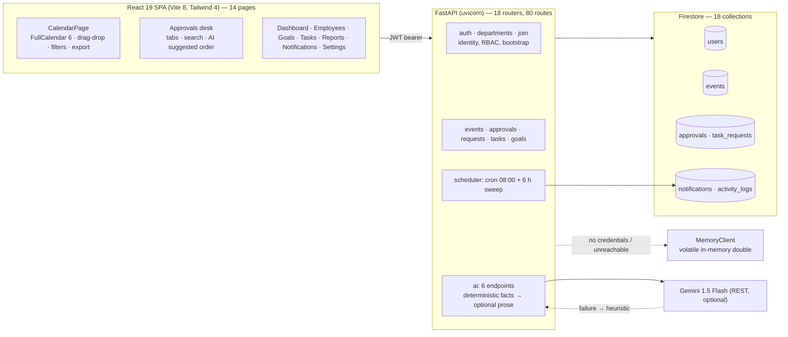

# HiéraSync AI: A Role-Aware Departmental Coordination System with a Deterministic Calendar Core and a Human-in-the-Loop Approval Desk

**Track:** Undergraduate project paper — Computer Engineering
**Authors:** [Author Name]$^{1}$, [Co-author Name]$^{2}$, [Guide Name]$^{3}$
**Affiliation:** $^{1,2,3}$ Department of CSE (Artificial Intelligence & Machine Learning), [Institute Name], [City], India
**Correspondence:** [email]
**Source / reproducibility:** https://github.com/Atulgupta07/Hiera_Sync

> **Body length:** 5,303 words (Abstract + §1–§9) — the size of an 8–10 page IEEE two-column
> paper. Per section: Abstract 282 · §1 482 · §2 1067 · §3 462 · §4 1140 · §5 694 · §6 574 · §7 317 · §8 182 · §9 103. References and appendices are excluded. Delete this block
> before submission. 5,238 words (Abstract + §1–§9) — the size of an 8–10 page IEEE two-column paper.
> Per section: Abstract 282 · §1 Introduction 482 · §2 Related work 1,042 · §3 Requirements 458 ·
> §4 Design 1,122 · §5 Implementation 688 · §6 Verification 562 · §7 Uniqueness 317 · §8 Limitations 182 ·
> §9 Conclusion 103. References and appendices are excluded from that count. Delete this block before submission.

---

## Abstract

Departmental coordination in an engineering college is usually carried out in spreadsheets, WhatsApp
groups and paper notes. Existing research targets either *scheduling* (timetabling, meeting choice) or
*digitising a document chain*, but rarely the state that sits between them: who owns which activity,
what is overdue, and what needs a decision today. This paper presents **HiéraSync AI**, a role-aware
departmental coordination system in which an activity calendar is the primary working surface and an
approval desk is its decision loop. The system couples a deterministic FastAPI/Firestore core —
18 collections, 80 routes, calendar invariants enforced server-side, RFC 5545-compatible export — with an
explainable suggestion layer: every AI ranking is produced by an auditable scoring function first and may
be dressed in prose by Gemini only as a second step, so a missing or failing model never blocks work.
Three properties are treated as first-class engineering requirements rather than afterthoughts: a
cold-start bootstrap protocol that lets the first account start a department without an administrator,
permission checks enforced on both sides of the API boundary, and a volatile in-memory double of the
Firestore interface that makes the whole system demonstrable without credentials. A development test
campaign (nine harnesses, 106 counted assertions) exercised 34 endpoint paths in demo mode with zero 5xx responses,
and four defect classes found during that campaign — a HTTP-verb mismatch, trailing-slash routing,
silent project overrides and case-sensitive email authentication — are analysed as transferable
findings. An evaluation protocol for a user study (SUS plus decision-quality measurement against the
HOD's final ordering) is specified; results are not yet in scope.

**Keywords:** academic workflow management; department information system; calendar scheduling; approval
workflow; large language models in administration; Firestore; role-based access control; explainable AI.

---

## 1. Introduction

A Head of Department in an Indian engineering college spends a measurable part of the week on
coordination rather than on academics: allocating invigilation and duty rosters, chasing consent for a
guest lecture, deciding which of four pending requests is urgent, and re-issuing a circular after a
reschedule. The tools used for this are not designed for it. A timetable generator solves a
constraint problem once per semester. A campus ERP records a decision after it has been made. Chat groups
carry the actual coordination but retain no state: nothing in them knows that an activity is now
overdue, that two meetings collide, or that one faculty member is carrying most of the work.

HiéraSync AI was built around a single design commitment: **the calendar is the system of record and
the approval desk is its decision loop**. A request that is approved becomes an activity on the calendar;
an activity carries an owner, a priority, a status and a reminder; a reminder becomes a notification with
a deep link back into the calendar. The AI layer is deliberately conservative. It ranks and explains, it
never mutates state on its own, and its prose is generated *from* deterministic facts rather than being
the source of them.

Contributions of this paper:

1. **A coordination-state data model** for a single academic department (18 Firestore collections, 12-field
   activity record, four-state activity lifecycle `Planned → Assigned → Review → Completed`) in which
   approvals, tasks, goals and calendar events share one identity and one permission model.
2. **A proposal-then-confirm pattern for administrative AI**, in which a transparent scoring function
   produces a ranked queue with explicit reasons and a response field (`source: heuristic | gemini`)
   discloses whether natural-language prose was generated. The feature degrades to the deterministic
   ranking when no model is configured.
3. **A cold-start bootstrap protocol** for self-hosted deployments: the first registered account may claim a
   department while still `PENDING` *only when the departments collection is empty*, is activated by doing
   it, and is promoted to HOD if its role would otherwise leave it without approve controls.
4. **A volatile in-memory double of the Firestore client** (`MemoryClient`) supporting positional and
   `FieldFilter` queries, ordering, limits and streaming, so that an entire role-gated workflow — including
   the bug classes listed below — is reproducible and testable without cloud credentials.
5. **Empirical findings from a development test campaign** and four defect classes that made an
   otherwise-correct system unusable, analysed with their root causes and fixes: verb mismatch between a
   generated client and a hand-written route (405), Starlette slash-redirect masking, a service-account
   project being silently overridden by configuration, and case-sensitive email authentication locking out
   correct passwords.

The paper is organised as follows: §2 positions the work against recent systems, §3 derives requirements,
§4 presents the architecture and its invariants, §5 the implementation, §6 the verification and what it
did and did not establish, §7 the uniqueness claim and its boundaries, and §8 the limitations.

---

## 2. Related work

### 2.1 Department and academic-affairs information systems

The closest published system to ours is the **Academic Affairs Management System** [1]: role-based
dashboards for Employee, HOD, Principal and Admin, a multi-stage document approval chain with real-time
status synchronisation, AI-assisted document summarisation, and a React/Tailwind front end. It frames the
institutional problem well and is the natural baseline for "what such a system already contains". Its
unit of work, however, is a *document* travelling up a chain. In HiéraSync the unit of work is a *dated
activity with an owner*, and the approval step is one transition on that record rather than the whole
data model. **Formal document approval workflows in higher education** [2] take the more rigorous route of
modelling the chain as a business process with rules, validation and an audit trail; we adopt that
discipline for state transitions and activity logs, but not for a multi-office signature sequence, which in
a single department adds latency without adding assurance. Two studies measure the practical benefit of
this class of system: a budget-request tracking and approval platform reported improvements in processing
time, error frequency and usability on a validated questionnaire (Cronbach's α = 0.90) [3], and a
design-science development of digital academic services reduced a thesis-registration cycle "from several
days to minutes" [4]. Commercial and open-source platforms — SAP SLCM, Fedena, OpenEduCat, EduSec — are
surveyed within [1]; all are student-record-centric, and their approval modules are record-keeping rather
than coordination surfaces. Simpler web implementations of the same problem space — a Django-based
student-management system [5] and a layered smart-campus architecture with cloud deployment and secure
authentication [6] — are useful as "conventional approach" comparators: relational schemas, no calendar
engine, no suggestion layer. A recent AI-enabled information system for challenge-based capstone matching [27]
shows the same full-stack pattern applied to a different university unit.

### 2.2 Calendar and scheduling assistance

Recent scheduling research is largely conversational. **ScheduleMe** [7] coordinates specialised agents —
event creation, availability checking, conflict resolution — under a supervisory agent over Google
Calendar, and reports the privacy exposure inherent in sending calendar text to a hosted model; that
exposure applies unchanged to any assistant with department data, which is why HiéraSync keeps the model
out of the write path. **Togedule** [8] uses an LLM to adapt *which* candidate meeting slots are shown and
in *which* presentation, recommending a final time from attendee priorities; a formative study (N=10) and
two controlled experiments (N=66) show reduced cognitive load for attendees and faster, better-organised
decisions. This is the closest published analogue to our approval ranking, with the difference that Togedule
optimises slot choice for a meeting while we rank a queue of pending decisions. **Automated scheduling for
thematic coherence in conferences** [9] formalises the trade-off we implement informally: hard constraints
(no double-booking, room capacity) versus soft ones (preferences, coherence), solved with a CSP model over
NLP-derived similarity. **The ICAPS survey of LLMs for automated planning and scheduling** [10] is the
cautionary reference: across 53 papers, LLM-generated plans remain weak on validity, completeness and
optimality relative to combinatorial planners. Our architecture follows that evidence literally — the
deterministic checker owns correctness, the model owns phrasing.

### 2.3 Workload, fairness and duty allocation

Timetable-generation work supplies the load-balancing vocabulary. An AI-based real-time timetable and
faculty scheduling system explicitly describes calendar views, conflict alerts and **heat maps for faculty
load** with a feedback loop for continuous refinement [11]; an adaptive scheduler generates timetables with a
genetic algorithm over faculty availability and subject preferences, collects feedback and exports the
result [12]. A quantified workload-balance model validated on institutional data [13] supports equity
claims that a dashboard alone cannot justify, and a learning-based system for allocating examination duty
[14] demonstrates the feature set we mirror — prior duty count, experience, availability, leave status and
expressed preference.

### 2.4 Generative AI in academic administration

**LLM agents for education** [15] surveys pedagogical and domain-specific agents and names the deployment
barriers we design against: hallucination, over-reliance, and integration with existing institutional
ecosystems. A parallel review of educational agents covers the ethics and governance layer expected of any
assistant that touches staff records [16]. The strongest measurement template is the deployment study of
GenAI assistants in a university's administrative service [17]: query volumes before and after
introduction, accuracy stratified by query complexity, and the conclusion that such assistants act as an
*augmentative* resource rather than an autonomous decision-maker. Institutional-level evidence pools
substantial reported gains — administrative-workload reduction near 62 %, task-completion time cuts above
50 %, roughly 70 % of assessment-related processes automated — alongside the barriers of privacy,
infrastructure and cultural resistance [18]. Retrieval-augmented academic analytics [19] shows BI data
being queried in natural language, which is the same loop our dashboard-summary and calendar-insight
endpoints close. Complementary evidence concerns notification design: a field experiment (N=247) found
that reducing notification-caused interruptions improves performance and lowers strain, and that
*batching* outperforms total silencing, which raises anxiety [20].

### 2.5 Stack justification and evaluation instruments

Firestore's own characterisation — stable notification latency as Listen connections grow, commit latency
governed by document and field *size* rather than field *count* — is documented in a peer-reviewed
industrial paper [21]. Head-to-head Firestore-versus-MySQL benchmarking [22] gives the trade-off honestly:
roughly 25 versus 45 write operations per second, ~$1.30 versus ~$35 for a one-million-object scenario, and
66.7 s versus 0.9 s for a million-document range scan, concluding that a document store is preferable for
growth and cost while losing on wide range queries; a study of Firestore data-modelling practice [23]
shows pre-computed aggregates reduce read counts, cost and response size. For access control in academic
platforms, RBAC hierarchies separating read-only, editing and administering roles are argued specifically
for university digital systems [24]. For evaluation, a systematic mapping of 30 Springer-indexed information-
system papers (2021–2025) documents how the System Usability Scale is applied, with respondent counts and
typical score ranges [25], and an SUS study of a higher-education audit system demonstrates comparison
against older academic platforms [26].

### 2.6 Gap

Across these bodies of work the split is clean: scheduling systems model *when*, document systems model
*what was decided*, workload allocation models *who*, and GenAI deployments model *how to answer a
question*. None of the surveyed systems holds all four in one store with one permission model and one
decision surface, and none reports a cold-start protocol for the case where the department that must be
approved by a HOD has no HOD yet. That intersection is what this paper describes.

---

## 3. Problem analysis and requirements

### 3.1 Observed failure modes in the current manual practice

Working with a single department's administrative routine, five recurring failures were recorded as the
design drivers: (i) reschedules announced in chat never reach the room register, producing double-bookings;
(ii) requests wait in a queue with no ordering, so the oldest and the most consequential compete equally;
(iii) duty allocation is invisible, so the willing accumulate work; (iv) an approved request dies there,
because the person who approved it must re-enter it as a task somewhere else; and (v) nothing can be
demonstrated to a reviewer without a live cloud project.

### 3.2 Functional requirements

FR1 Authentication and five-actor authorisation (ADMIN, PRINCIPAL, HOD, TEACHER, FACULTY, and a broader
`RoleEnum` of ten roles carried for institutional fit). FR2 Registration with a department-code join
request, an approval queue and an alternative "create the department" path. FR3 Activity calendar with
create/read/update/delete, five activity types, four-state lifecycle, timed and all-day records, owner,
location, priority. FR4 Drag-and-drop rescheduling with server persistence and client-side revert on
failure. FR5 Filtering by type, owner, upcoming-only flag and free-text search over six fields, plus
per-day and per-person load aggregates. FR6 Export of the *currently visible* range as RFC 5545 `.ics` and
as CSV. FR7 Approval desk where a decision on a request creates the corresponding task atomically and
links it back (`created_task_id`). FR8 Notifications generated by a background scheduler with a deep link
to `/calendar`. FR9 Six AI endpoints (dashboard summary, calendar insights, notification summary, approval
suggestions, chat, report generation). FR10 Faculty research/profile records, goals with milestones, and
report/analytics roll-ups.

### 3.3 Non-functional requirements

NFR1 Zero-credential demonstrability. NFR2 Every AI statement traceable to a deterministic source. NFR3
Permission checks enforced server-side, not by UI hiding. NFR4 Availability under a missing model key or an
unreachable API. NFR5 Consistent visual grid across 14 pages. NFR6 Passwords stored only as bcrypt hashes.
NFR7 An authentication path that does not depend on how a user typed their address.

### 3.4 Requirement traceability

**Table II.** Requirement traceability.

| Requirement | Implemented in | Verified by |
|---|---|---|
| FR3/FR4 calendar + reschedule | `events.py`, `CalendarPage.tsx` (`eventDrop`, `canManage`) | smoke suite (ISO round-trip), utility suite (day keys, overlap) |
| FR5 filtering, load legibility | `matchesFilters`, `eventsByDay`, `workload` memos | utility suite + build |
| FR6 export | `buildICS` / `buildCSV` in `utils/calendar.ts` | utility suite: folding, escaping, all-day arithmetic |
| FR7 decision → task | `requests.py` (`_task_from_request`, `created_task_id`) | request-semantics suite (11 assertions) |
| FR8 reminders | `scheduler/jobs.py` | manual sweep verification + marker idempotence |
| FR2 + bootstrap (NFR: self-start) | `departments.py` bootstrap rule, `ProtectedRoute`, `CreateDepartment` | bootstrap suite (12) + fresh-database suite (15) |
| NFR2, NFR4 | heuristic-first AI endpoints with `source` field; `MemoryClient` | endpoint sweep (0 5xx), demo-mode `GET /health` |
| NFR6, NFR7 | `auth/password.py`, `auth/lookup.py` | email-casing suite (17 assertions) |

---

## 4. System design

### 4.1 Architecture



**Fig. 1.** Component and data-flow overview of HiéraSync AI.

Three properties of this decomposition matter for the claims in §7. The client never writes to the
database directly; every AI endpoint reads the same collections the UI reads, so a suggestion cannot
contradict the grid it is displayed above; and the storage boundary has two interchangeable
implementations behind one interface, chosen at process start.

### 4.2 Coordination-state data model

**Table III.** Coordination-state collections in Firestore.

| Collection | Role in the loop | Notable fields |
|---|---|---|
| `users` | identity + profile | `id, email (normalised), hashed_password, role, department_id, status, designation, area_of_interest, joining_date, association` |
| `departments` | tenancy unit | `id, name, code (8-char invite), hod_id, is_hod` |
| `join_requests` | admission to a department | `faculty_id, department_id, status` |
| `events` | **activity of record** | `title, date (ISO), type, person, description, status, priority, location, start_time, end_time, all_day, notify_assignee` (12) |
| `approvals`, `task_requests` | decision queue | `title, requested, assigned, priority, status, created_task_id` |
| `tasks`, `task_comments`, `task_attachments` | execution after approval | risk score, subtasks, files |
| `department_goals`, `goal_milestones` | term objectives | `title, description, target date, order` |
| `notifications` | nudge channel | `user_id, title, message, type, priority, target_route, read` |
| `activity_logs`, `ai_chats`, `settings`, `files` | audit and context | — |

Two invariants are enforced in the model layer rather than the UI. Dates are normalised to `YYYY-MM-DD`
by a `field_validator`, because every downstream computation — day keys, relative labels, overdue
detection, ICS generation, per-day aggregation — assumes it; the same validator maps an unknown activity
type to `Academic` and an unknown status to `Planned`, so no record can enter an unrenderable state.
Second, notification addressing resolves a display name to a `user_id` and falls back to a `department`
channel when the owner cannot be resolved, which keeps a reminder from silently disappearing.

### 4.3 Authorization, bootstrap and the PENDING deadlock

Ten roles exist in `RoleEnum`; four carry meaning in this deployment (ADMIN, PRINCIPAL, HOD, and
TEACHER/FACULTY as peers). Guards are decorators (`get_current_active_user`, `check_role`) applied on the
route, and — importantly — the review-role rule is duplicated inside the mutation handlers for the
request/approval resources so that a partial update cannot bypass it: non-reviewers may only cancel their
own pending request.

The hardest control-flow problem was not permission but *sequencing*. Registration creates a `PENDING`
profile; only an `ACTIVE` HOD may approve a profile; therefore on a fresh database nobody can approve the
account that would create the first department. The system solves this with a narrow rule in
`POST /departments`: when the `departments` collection is empty, the request is a **bootstrap**. The
caller may be `PENDING`; creating the department links it to their profile, activates them, and promotes
their role to HOD if it is lower — because a FACULTY dashboard has no approve controls, and a founder who
cannot approve anyone cannot run a department. The response carries `bootstrap: true` so the client can
explain what just happened instead of reloading into a mystery. On a non-empty database the rule disappears:
an inactive account is refused, and the ordinary approval path applies. Two UI consequences were necessary
for this to be reachable at all: a `PENDING` user must be allowed to open the *create*-department route, not
only the join route, and the create page must decide "already manages a department" by querying
`GET /departments/me` rather than by trusting a placeholder written at registration.

### 4.4 Deterministic calendar core, explainable AI wrapper

The AI surface is six endpoints, and each follows one rule: compute, then optionally narrate. The approval
ranking is a transparent function over the queue:

```
weight(priority) ∈ {urgent 70, high 60, medium 30, low 10}, default 20
score = weight + min(30, 4 · age_in_days) + (8 if no reviewer note else 0)
reason = human-readable conjunction of the contributing factors
return top-3 by score, each with its reason string
```

Nothing in that computation requires a model, so the endpoint is correct and available offline; a response
field (`source: "heuristic" | "gemini"`) records whether the accompanying sentence was model-generated, and
the Gemini path (`gemini-1.5-flash:generateContent`, called over plain REST) is wrapped so that any
exception falls back to the heuristic with a logged warning. The remaining deterministic endpoints take the same shape:
the notification digest selects the caller's own feed (`user_id ∈ {self, "department"}`), counts unread items,
groups them by type and lifts the three highest-priority unread titles; the dashboard summary pre-computes
per-assignee workload and a per-task risk score before composing its sentence. Two endpoints are
intentionally narrower and are reported as such: the chat endpoint is a pass-through to the configured model,
answering with an explicit "simulated mode" notice when no key is set, and report generation returns a fixed
template; neither reads department state, so the paper treats them as presentation surfaces rather than
retrieval features (§8). The consequence is that the system can be evaluated as a decision-support tool even
in the ablation where no model is present — a property most "AI feature" systems in this category cannot claim.

### 4.5 Reminders

A background scheduler (`APScheduler`) starts on the application's startup hook and stops on shutdown, with
two triggers: a cron job at 08:00 and a six-hourly sweep. Each pass runs two independent rules over `events`.
*Reminders*: every activity dated within a two-day horizon that is not `Completed` queues a notification to
its resolved owner carrying the date, start time and location, the activity's own priority, and
`target_route: "/calendar"`. *Escalations*: every activity whose date has passed while its status is not
`Completed` queues a `High` priority notification telling the owner to update or reschedule. Both rules are
idempotent by per-record marker — the sweep writes `reminded_at` / `overdue_notified_at` back onto the
activity document and skips any record already carrying one — which is what makes a six-hourly cadence safe
on a long-lived process. Owner resolution maps the stored display name to a `user_id` and falls back to the
shared `department` channel; the job no-ops with a log line when no database handle exists.

### 4.6 Portability and the demo double

`.ics` generation is written rather than delegated: `DTSTART;VALUE=DATE` with an exclusive `DTEND` of day+1
for all-day events, local floating times for timed events, a `DTSTAMP` in the mandated form, escaping of
`\`, `;`, `,` and newlines in that order, and folding of every line to ≤75 octets with CRLF terminators.
This is unit-tested against the produced text, because interoperability failures in calendar software are
invisible to the author and immediate to the recipient.

The `MemoryClient` double implements `collection/document/query/stream` semantics over process-local
dictionaries, including both query styles used in the codebase (positional `.where(f, op, v)` and
`.where(filter=FieldFilter(...))`), `in`/`not_in`/`array_contains_any`, ordering, limits and merge-writes.
When no service-account file is found — or the found file cannot reach a database — the application
switches to it, logs the reason, and reports the state through `GET /health` (`database:
"memory (volatile demo data)"`, with `project` populated only for a real connection). Registration in this
mode mints local identifiers and activates them, which is what makes a six-command demonstration possible.

---

## 5. Implementation

**Stack.** Back end: Python 3.11, FastAPI with `uvicorn[standard]`, Pydantic v2 (with `pydantic[email]`),
`firebase-admin`, `python-jose` for JWT, `passlib[bcrypt]`, APScheduler. Front end: React 19, TypeScript,
Vite 8, Tailwind CSS 4, FullCalendar 6.1. Data: Cloud Firestore. AI: Gemini 1.5 Flash over REST.
Volume: 5 287 lines across 36 Python files, 10 792 lines across 58 TypeScript/TSX files, 8 129 lines of
CSS; 18 routers, 80 route declarations, 14 pages, 5 shared components.

**Authentication.** Login compares a bcrypt hash held on the `users/{uid}` document; the Firebase Auth
user is created as a courtesy on registration but is not consulted at sign-in, which keeps the department
database authoritative and the system self-contained. Failure modes are distinguished deliberately: a
missing profile, a profile without a stored hash (the usual case for an account created in the cloud
console) and a malformed hash each produce an explicit message rather than a generic 401 or a 500. Emails
are normalised to a trimmed lowercase form on write and resolved on read through a single lookup helper
that tries the exact stored value, the normalised value and finally a case-insensitive scan — legacy rows
written before normalisation can still sign in, and a token issued from such a row continues to
authenticate.

**Consistency details that turned out to matter.** Every resource route is declared without a trailing
slash, because a slash-redirect otherwise turns a `PUT` with a body into a `307` and the retry loses the
payload in some clients; the request-update route accepts both `PATCH` and `PUT` because the generated
client uses the latter; approval and rejection write an activity log entry and notify the requester; and
the scheduler's reminders are made idempotent by per-record markers (§4.5). Each of these came from a failure observed in testing, not
from a style preference.

**Typed client layer.** The front end reaches the API through 18 small typed modules (`authApi`,
`eventsApi`, `approvalsApi`, …) layered on one `client<T>()` fetch wrapper that injects the bearer token,
JSON-encodes the body and re-raises the server's `detail` string as an error message — which is why a
failure on screen is a sentence ("Only the HOD desk can reschedule activities.") rather than a status code.
Token persistence is chosen per login, and authorisation state is derived from the profile the token
resolves to, so a stale local role cannot open a surface the server would refuse.

**Graceful degradation, visibly.** Each data page tracks whether it is serving `live` or `preview` records;
a failed fetch flips the calendar to seeded preview data and the toolbar says so ("Offline preview data"
versus "Live · Firestore"). In preview mode mutations persist to `localStorage` under
`hiera:calendar:preview-events`; in live mode a write is optimistic and reverted with a toast if the API
rejects it. This is a demonstration affordance, not an offline-synchronisation design — there is no merge or
replay — and §8 records that as remaining work.

**Calendar export written by hand.** The generator is a small function rather than a dependency, because the
interoperability failures that matter are lexical:

```
header     BEGIN:VCALENDAR · VERSION:2.0 · PRODID:-//HieraSync AI//Academic Calendar//EN
           · CALSCALE:GREGORIAN · METHOD:PUBLISH
per event  UID:<id>@hiera-sync · DTSTAMP:<UTC, YYYYMMDDTHHMMSSZ>
  all-day  DTSTART;VALUE=DATE:<YYYYMMDD>  ·  DTEND;VALUE=DATE:<date+1>   (exclusive end)
  timed    DTSTART:<YYYYMMDDTHHMMSS> (floating local)  ·  DTEND from end_time, else start_time
  text     SUMMARY · DESCRIPTION (note · Owner: person · Type: type) · LOCATION
escape     backslash first, then ";" then ",", newline → space
fold       every line to ≤75 octets, CRLF + single space to continue; CRLF between lines
csv        every cell quoted, embedded quotes doubled (RFC 4180)
```

**Front-end design system as a usability requirement.** Shared tokens in `index.css` define four families —
Manrope (body), Roboto Slab (display and numerals), Saira (labels and controls), Google Sans Flex in the
fallback stack — loaded from Google Fonts, plus a radius scale (4/6/8/10/12/14 px) with Tailwind's
`md/xl/2xl/3xl` remapped onto it, which is how "sharper bento corners everywhere" was achieved without
editing 14 pages. Alignment is a contract rather than a habit: pages use `.hs-page` (or a full-bleed
`.hs-shell-pad` variant), the layout's `<main>` carries no padding at all, `--hs-content-max: 1440px` with
a single gutter token, and `scrollbar-gutter: stable` prevents a per-page horizontal jump. FullCalendar is
themed through its own CSS variables so the grid follows the same palette. Calendar affordances:
month/week/day views at a 30-minute slot, drag-and-drop gated by `canManage` with optimistic update,
local persistence of the optimistic state, revert-and-toast on failure, a day rail listing the selected
date, per-day density classes (`has-events`, `is-busy` above two activities), a workload ranking that names
the person carrying the heaviest load, and range-scoped `.ics`/CSV export of exactly the rows being viewed.

---

## 6. Verification and results

### 6.1 What was executed

Nine harnesses were run against the application using an in-process test client in demo mode — demo mode is
what makes them independent of cloud state — totalling 106 counted assertions plus the endpoint sweep.
Table I summarises what each establishes.

**Table I.** Development verification harnesses.

| Harness | Assertions | Establishes |
|---|---|---|
| API smoke suite | 24 | every CRUD resource responds and round-trips ISO dates |
| bootstrap suite | 12 | PENDING creator → department → ACTIVE HOD, invite code issued |
| endpoint sweep | 34 paths | **0 responses in 5xx** across all routers in demo mode |
| task-request semantics | 11 | `PUT`/`PATCH` equivalence, non-reviewer may only cancel own request, approval creates a task and stores `created_task_id` |
| fresh-database UI path | 15 | register → claim → colleague joins by code → approve → guarded data endpoint returns 200; wrong code 404; second department refused |
| PENDING claim test | — | `/events` returns 400 before the claim and 200 after |
| email-casing suite | 17 | mixed-case register, uppercase and padded login, legacy mixed-case row, id-less row, PENDING heal **persisted**, wrong password still 401 |
| access-repair script suite | 18 | account repair, department linking, idempotence, department resolution by id/code/name |
| calendar utilities (Node) | 9 | ICS folding/escaping and all-day arithmetic, CSV, relative-day and overlap helpers |

The front end additionally passes a TypeScript project build (`tsc -b`) and a production Vite build with no
errors.

### 6.2 Defect classes found, and what they teach

1. **Verb mismatch (405).** The approval edit route was declared `PATCH` while the client sent `PUT`. A
   generated client and a hand-written router can each be "correct" and the feature is simply dead; no
   unit test on either side notices. *Lesson: treat the OpenAPI surface as a contract and test the pair.*
2. **Trailing-slash redirects (307 → lost body).** Masked by test clients that follow redirects. *Lesson:
   disable the tolerance in your own routing, and disable `follow_redirects` in tests.*
3. **Silent project override.** Passing an explicit `projectId` alongside a service-account certificate let
   the application talk to a *different, empty* project while the key file looked correct, and the symptom
   surfaced three layers away, as "incorrect email or password". *Lesson: derive identity from the
   credential, log the resolved project id at startup, and surface it in a health endpoint.*
4. **Case-sensitive authentication.** Emails were stored exactly as typed and compared byte-for-byte, so a
   correct password with a differently-typed address failed. *Lesson: normalise on write **and** remain
   tolerant on read; a migration is not optional for rows that already exist.*

Class 3 and 4 together explain the most-reported failure in this kind of deployment — the login form — and
their diagnosis is the reason `GET /health` exists in this system.

### 6.3 Security posture

JWT bearer authentication with expiry; bcrypt cost 12; plaintext passwords never persisted; role checks on
the route *and* inside mutating handlers; department-scoped reads; an access-repair script intended for an
operator holding the project's own service-account key. Two known debts are recorded rather than hidden:
the JWT signing key exists in the repository's history and must be rotated, and the service-account JSON is
resolved from the working directory with a repository fallback, which is convenient for local work and
wrong for a shared host.

### 6.4 What has not been established

No human-subject study has been run. §6 therefore reports engineering correctness, not measured
effectiveness on the department; Appendix A specifies the protocol and the exact numbers to collect, and
the comparison in Appendix C is based on what the cited papers describe, not on side-by-side execution.

---

## 7. Uniqueness and discussion

Claims, each tied to a section above:

1. **Approval that produces work.** A decision on the desk creates the task and stores the link, so the
   queue and the calendar never disagree (§4.2, tested in §6.1).
2. **Explainable, ablatable AI.** Ranking is a visible arithmetic function with per-item reasons; the model
   adds prose and is explicitly disclosed and optional (§4.4). Most systems in [1,17] treat the model as the
   feature; here it is the presentation of one.
3. **Cold-start completeness.** The bootstrap rule plus its two UI preconditions make the system startable
   by its first user with no administrator in the loop — a problem none of the surveyed academic systems
   states (§4.3), and one that is only visible when a fresh project is actually tried.
4. **Credential-free demonstrability of a cloud-native system.** The in-memory double is complete enough to
   run role-gated workflows and the scheduler, which turns review, teaching and CI into the same activity
   (§4.6).
5. **Portability as a tested contract.** RFC-conformant `.ics` output verified at the text level, exported
   for exactly the visible range — the detail that decides whether the system ever leaves its own UI.
6. **Load legibility.** Per-day density and per-person workload ranking live in the same surface as the
   schedule, i.e. fairness data is adjacent to the act of assigning rather than in a report afterwards.
7. **A diagnosis record for this class of application.** §6.2 generalises four defects that a colleague
   building the same kind of system is likely to meet.

What is *not* claimed: a new scheduling or matching algorithm (the calendar enforces constraints, it does
not search a solution space, unlike [9,11,12]); an institutional-scale deployment; or a general-purpose
campus ERP. The contribution is the integration of coordination state, decision loop and explainable
suggestion in one role-aware system for a single department, plus the engineering consequences of doing so.

---

## 8. Limitations and future work

Scope is one department: `department_id` filters reads but there is no tenancy isolation at the database
level, so multi-department use needs security rules or per-department collections. Queries are indexed on
`where` pairs without composite indexes, and the case-insensitive email fallback scans the `users`
collection — acceptable at department scale (tens to low hundreds of profiles), not at institutional scale.
Reminders use a fixed two-day window and priority weights are hand-tuned rather than learned. Notification
delivery is in-app only; email and Google Calendar synchronisation are the natural extensions, together with
the ablation study of the suggestion layer (deterministic ranking versus LLM-authored prose) and the
composite-index migration. A per-user invitation flow replaces the shared default password used for
admin-created accounts, and the `reminded_at` / `overdue_notified_at` markers should be exposed on the event
response so the interface can show whether a reminder has already gone out. Wiring the chat endpoint and the
report generator to the same aggregates the deterministic endpoints already read is the highest-value
remaining item: today both are presentation surfaces rather than retrieval features, and the paper says so.

---

## 9. Conclusion

HiéraSync AI treats departmental coordination as one stateful object rather than three disconnected tools,
and demonstrates that the hard parts of such a system are not the model: they are the invariants (dates,
permissions, identities), the ordering you can defend in a meeting, and the ability of the first user to
open the door behind them. The implementation is verifiable without credentials — 34 endpoint paths in demo
mode with zero server errors and 106 counted assertions across nine harnesses — and the remaining gap between
"working" and "useful" is now an instrumentation task, specified in Appendix A, rather than an
architecture question.

---

## References

1. Academic Affairs Management System (AAMS). *IJCRT*, Dec 2025. https://www.ijcrt.org/papers/IJCRT2512536.pdf
2. Velásquez-Angamarca, V. et al. A Formal Document Approval Workflow for Business Process in Higher Education Institutions. *LNNS* 1747, Springer. https://doi.org/10.1007/978-3-032-12879-9_8
3. Juatchon, M. R. V., Nacino, J. Z. Optimizing Budget Request Flow Through WU-P Automate. *IJAEMR* 10(5), 2025. https://www.ijaemr.com/uploads/pdf/archivepdf/2025/IJAEMR_743.pdf
4. Waruwu, M. et al. Development of Digital-Based Academic Services System in Higher Education. *IRJMS* 6(4):92–103, 2025. https://doi.org/10.47857/irjms.2025.v06i04.04750
5. Shelke, K., Khan, Y., Kapse, A. S. Student Management System: A Web-Based Solution for Academic Administration. 2025. https://www.researchgate.net/publication/391478463
6. Pardeshi, A., Bari, P., Patil, L. Smart Campus Management System Using Modern Web and Networking Technologies. *IJERT* 15(2), 2026. https://doi.org/10.5281/zenodo.18815064
7. Wijerathne, O. et al. ScheduleMe: Multi-Agent Calendar Assistant. *PACLIC 2025*. https://aclanthology.org/2025.paclic-1.27/ · https://arxiv.org/abs/2509.25693
8. Song, J., Ashktorab, Z., Malone, T. W. Togedule: Scheduling Meetings with Large Language Models and Adaptive Representations of Group Availability. *CSCW 2025*. https://doi.org/10.1145/3757513
9. Emu, M., Ahmed, T., Choudhury, S. Automated Scheduling for Thematic Coherence in Conferences. *AIware 2024*. https://doi.org/10.1145/3664646.3665085
10. Pallagani, V. et al. On the Prospects of Incorporating LLMs in Automated Planning and Scheduling. *ICAPS 2024*. https://arxiv.org/abs/2401.02500
11. Artificial Intelligence for Real-Time Automated Timetable and Faculty Scheduling in Colleges. *All Scientific Journal* 10(3), 2025. https://allscientificjournal.com/assets/archives/2025/vol10issue3/10072.pdf
12. Adaptive Scheduler: AI Optimization of Academic Timetable. *IJSDR*, 2025. https://ijsdr.org/papers/IJSDR2504317.pdf
13. Guerreiro, R., Santos, G., Santos, A. S., Tereso, A. P. Allocation Model for Workload Balance: A Case Study. *LNNIS* 1226, Springer, 2025. https://doi.org/10.1007/978-3-031-78934-2_10
14. Naik, S., Gururaja, S. Machine Learning-Based Prediction System for Optimized Faculty Exam Duty Allocation. *IJERT* 14(01), 2026. https://doi.org/10.17577/IJERTCONV14IS010050
15. Chu, Z. et al. LLM Agents for Education: Advances and Applications. *EMNLP 2025 Findings*. https://arxiv.org/abs/2503.11733
16. AI-Powered Educational Agents: Opportunities, Innovations, and Ethical Challenges. *Information* 16(6):469, 2025. https://doi.org/10.3390/info16060469
17. López-Galisteo, A. J. Optimizing University Administrative Services with Generative AI. *Information* 17(6):587, 2026. https://doi.org/10.3390/info17060587
18. Institutional approaches to generative AI management in higher education: a systematic review. *Frontiers in Education*, 2026. https://doi.org/10.3389/feduc.2026.1814426
19. LLM-Augmented Academic Analytics (RAAF). *JISEM*, 2025. https://jisem-journal.com/index.php/journal/article/download/14598/7035/25171
20. Ohly, S., Bastin, L. Effects of task interruptions caused by notifications… *J. Occupational Health* 65(1):e12408, 2023. https://doi.org/10.1002/1348-9585.12408
21. Firestore: The NoSQL Serverless Database for the Application Developer. Google Research (industrial paper). https://storage.googleapis.com/gweb-research2023-media/pubtools/7076.pdf
22. Evaluation of NoSQL in the Energy Marketplace with GraphQL Optimization. 2024. https://arxiv.org/abs/2403.04935
23. Semma, A. B. et al. Cloud Computing: Google Firebase Firestore Optimization Analysis. *IJEEEE* 29(3), 2023. https://doi.org/10.11591/ijeecs.v29.i3.pp1719-1728
24. Securing Academic Social Platforms: Implementing RBAC in University-Based Digital Systems. *IJRTI* 10(5), 2025. https://www.ijrti.org/papers/IJRTI2505044.pdf
25. System Usability Scale in Information System Application Development: A Systematic Mapping Study. *IJATIS* 2(2), 2025. https://doi.org/10.57152/ijatis.v2i2.2275
26. Irawan, Y., Suryani, F. B., Wanabuliandari, S., Muzid, S. SUS Model in Evaluating Internal Quality Audit Systems. *JAIC* 9(2):511–516, 2025. https://doi.org/10.30871/jaic.v9i2.9210
27. Albalawi, O. H. Smart Innovation Hub: An AI-Enabled Information System… *Information* 17(6):588, 2026. https://doi.org/10.3390/info17060588

---

## Appendix A — Evaluation protocol (fill in before submission)

Run after the system has been used for two weeks by one department. Every field below is a measurement to
collect, not a result to report; leaving them empty is honest, inventing them is not.

**A.1 Usability (instrument: SUS [25,26]).** 10 items, 5-point Likert, 15–20 respondents (target ≥5 HOD
or coordinator, ≥10 faculty). Report: mean ± SD, adjective rating, Cronbach's α, and any gender and role
splits.

| Group | n | SUS mean | SD | Adjective band |
|---|---|---|---|---|
| Faculty | __ | __ | __ | __ |
| HOD / coordinator | __ | __ | __ | __ |

**A.2 Task effectiveness (compare against the manual baseline, as in [3,4]).**

| Metric | Manual (spreadsheet/chat) | With HiéraSync | Δ |
|---|---|---|---|
| Median time to approve/reject a request (min) | __ | __ | __ |
| Double-booking incidents per month | __ | __ | __ |
| Requests older than 7 days at quarter end | __ | __ | __ |
| Reschedules communicated to the owner (%) | __ | __ | __ |
| Activities exported to a personal calendar (%) | __ | __ | __ |

**A.3 Suggestion quality.** For N ≥ 30 real pending requests, compare the system's top-3 order against the
HOD's final ordering: precision@1, Kendall's τ, and a 1–5 rating of each displayed reason ("did the stated
reason match why you decided?"). Also record the ablation: same queue ranked by `score` only versus
prose authored by Gemini [17] — does the prose change acceptance, and does it ever contradict the score?

**A.4 Performance and cost (method: as in [22,23]).** `GET /events` latency (p50/p95) at 100 / 1 000 /
10 000 activity documents for one department; Firestore document-read count per page load; cost per month at
the department's projected volume. Report the range-scan caveat explicitly — it is what makes the design
argument credible.

## Appendix B — Reproducibility

```bash
git clone https://github.com/Atulgupta07/Hiera_Sync && cd Hiera_Sync
git checkout arena/01a0a489-hiera-sync
# demo mode, no credentials needed:
cd backend && python -m venv .venv && source .venv/bin/activate     # Windows: .venv\Scripts\activate
pip install -r requirements.txt
python -m uvicorn app.main:app --port 8000                            # terminal 1
python scripts/seed_demo.py --only-admin --password "Hiera@2026"      # terminal 2 → prints invite code
cd ../frontend && npm install && npm run dev                           # terminal 3 → http://localhost:5173
```
Sign in as `hod@sbjit.edu.in` / `Hiera@2026`; `GET http://127.0.0.1:8000/health` reports which storage
implementation is live. Against a real Firebase project, place `firebase-credentials.json` in `backend/`
(or set `FIREBASE_PRIVATE_KEY_PATH`), and use `python scripts/grant_access.py --list` / `--email … --password
… --create-department` to create or repair the first account without the approval dance.

## Appendix C — Feature comparison (as described by each source)

| Capability | AAMS [1] | Doc-workflow [2] | Timetable GA [11,12] | ScheduleMe [7] | Togedule [8] | **HiéraSync AI** |
|---|---|---|---|---|---|---|
| Calendar as primary surface | no | no | partial (generated output) | yes (via Google Calendar) | partial | **yes, own store** |
| Drag-and-drop reschedule with persistence | no | no | no | via NL only | no | **yes + optimistic revert** |
| Approval chain with audit log | yes | yes | no | no | no | **yes + decision→task creation** |
| Per-person workload legibility | partial | no | yes (solver objective) | no | no | **yes, in-view** |
| AI suggestion with explicit reason | summary only | no | no | yes | yes | **yes, deterministic core** |
| Works with no model key / no cloud project | no | n/a | no | no | no | **yes (double + heuristic)** |
| Calendar export (.ics) | partial | no | PDF only | inherits Google | no | **yes, RFC-tested** |
| Cold-start bootstrap without an admin | not addressed | not addressed | n/a | n/a | n/a | **specified and tested** |
